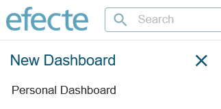

# Role dashboard creation button missing from ESM 2023.2.1

**Källa:** https://community.efecte.com/t/35h4hfq/role-dashboard-creation-button-missing-from-esm-2023-2-1
**Publicerad:** 2023-05-09T06:44:10.110Z
**Uppdaterad:** 2023-05-09T08:44:32.067000
**Författare:** 

---

Role dashboard creation button missing from ESM 2023.2.1

      
    
          
      

        
              Jonne KaukoProduct Manager
            

            Senior Product Manager & Product Lead, M42 Core & Pro
              Jonne_Kauko
            updated 2 yrs agoTue, May 9, 2023 at 8:44 AM GMT+2
  

          3replies
        Jonne KaukoProduct Manager2 yrs agoMon, May 22, 2023 at 12:40 PM GMT+2
  
         Fixed
        

        
    
 Detected in version: ESM 2023.2.1  
 Description: The button that allows users to create Role dashboards is not visible in the New Dashboard menu. The issue will be fixed in the next version (ESM 2023.3.0).     
     
  
 Mitigation: There is a workaround that allows users to create role dashboards.  
 
 Click the 'Create new dashboard' button in the navigation panel 
 Click 'Personal Dashboard' 
 Change the final part of the URL from 'USER' to 'ROLE' (see example below) 
 Drag views from a role to the dashboard 
 Save the dashboard under the role 
 
 Examples:   
  
 Original URL for creating a personal dashboard:   
https://environment.efectecloud.com/itsm/EfecteFrameset.do#/workspace/dashboard/new/USER  
 Changed URL for creating a role dashboard:  
https://environment.efectecloud.com/itsm/EfecteFrameset.do#/workspace/dashboard/new/ROLE
 
 As normally, for creating role dashboards, please make sure your user has permissions to edit role views.  
          
    
        Known Error
      
    
  
  Vote
  Follow

## Bilder

