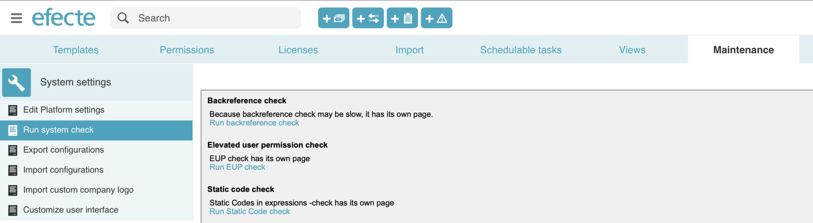
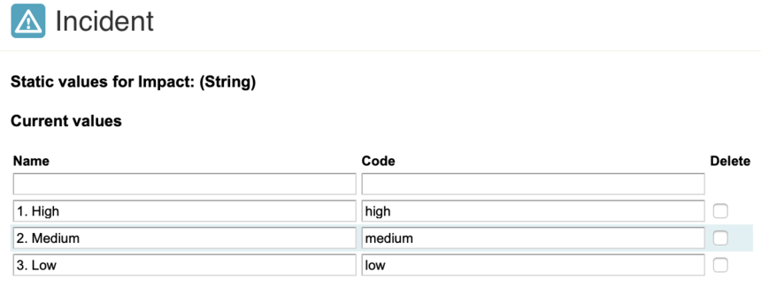

# This.Get Method Returns Attribute Value of Static String Attribute  Instead of the Attribute Code

**Källa:** https://community.efecte.com/t/y4hhpds/this-get-method-returns-attribute-value-of-static-string-attribute-instead-of-the-attribute-code
**Publicerad:** 2020-03-10T14:02:47.397Z
**Uppdaterad:** 2020-08-06T11:14:08.960000
**Författare:** 

---

This.Get Method Returns Attribute Value of Static String Attribute  Instead of the Attribute Code

      
    
          
      

        
              Aki Koivukoski
            

            R&D
              Aki_Koivukoski
            updated 5 yrs agoThu, August 6, 2020 at 11:14 AM GMT+2
  

          2replies
        Aki Koivukoski5 yrs agoTue, May 19, 2020 at 2:24 PM GMT+2
  
         Solved with Workaround
        

        
    

      
          

    
        
        
        
      

    

  ContentsIssue:Affected Releases:Workaround:Details:Issue: 
 The This.Get method in expressions returns the value of a static string attribute starting with Efecte 2019.4.1 instead of the attribute code. Previously, the method returned the attribute value if the code was not defined and the code if it was defined. If the attribute code was targeted to be received before this change, then this expression will be broken after activating the transport template feature in the system settings.  
Affected Releases: 
 Efecte 2019.4.1  
 Efecte 2020.1 and newer  
Workaround: 
 Run the Static code check (see image above) from the Admin UI in the Maintenance Tab. Replace the method in the identified expressions with the following method if you need the attribute code and not the attribute value: this.get(“staticStringAttribute”).getCode()  
Details: 
 An attribute of the type static string can have multiple values and each of these values can have a code.  
 In release 2019.4.1. we implemented a feature called "Transporting templates". This feature needs to be activated separately by an administrator once the here mentioned configuration compatibility has been checked and potential changes in the configuration have been applied. Efecte provides to its trained consultants a script that helps to identify potential configuration incompatibility.  
 Once the template transport feature is active, the system behaves differently in how the attribute values and codes can be accessed with expressions. The change makes this expression    
this.get("staticStringAttribute")   
 to return always the value of the static string and    
this.get(“staticStringAttribute”).getCode()  
 will return the code of the static string value.  
 Please check your configuration in case you have used static string value codes with your expressions!  
 For example, we have a test environment where we check a static string value code of an Impact for priority calculations. The Impact was defined as   
    
   We needed to change this expression for accessing the impact value codes  
impact.startswith("high") 
 to this  
impact.getCode().startswith("high") 
  
 (UPDATED on 11.03.2020 at 16:17: Template transport will be locked until it has been verified by an administrator that this known issue does not impact the functionality). 
          
    
        Service Management Tool
      
    
        Known Error
      
    
  
  Vote
  Follow
    
            1

## Bilder

