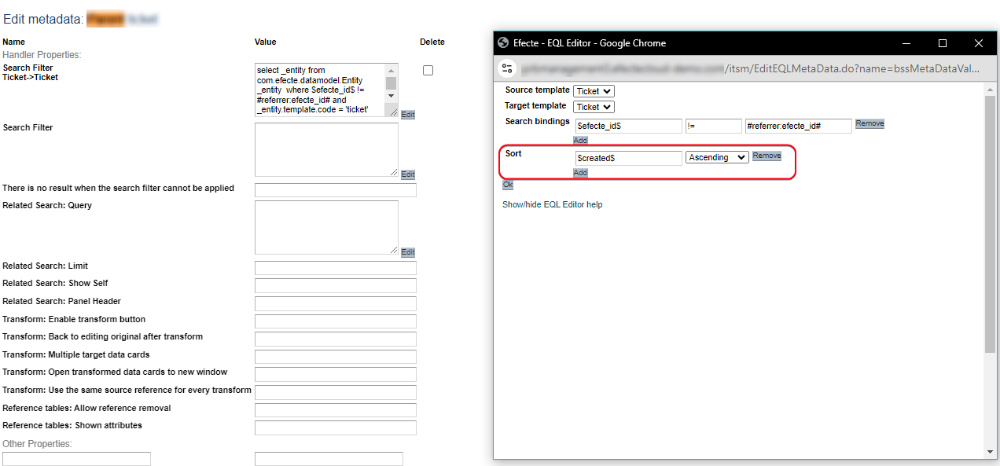

# ValueChangeMonitor and MonitoringStamp handler can miss changes in certain use case

**Källa:** https://community.efecte.com/t/x2ytgn2/valuechangemonitor-and-monitoringstamp-handler-can-miss-changes-in-certain-use-case
**Publicerad:** 2024-08-28T10:10:46.577Z
**Uppdaterad:** 2024-08-28T12:10:46.577000
**Författare:** 

---

ValueChangeMonitor and MonitoringStamp handler can miss changes in certain use case

      
    
          
      

        
              Marko LehtoEfecte Employee
            

            
              Marko_Lehto.1
            1 yr agoWed, August 28, 2024 at 12:10 PM GMT+2
  

          1reply
        Marko LehtoEfecte Employee7 mths agoFri, May 23, 2025 at 8:47 AM GMT+2
  
         Fixed
        

        
    
The following bug (CP-8320) has been identified in ESM:
When a reference attribute has a search condition and sorting of the results (see picture),

 
opening this reference attribute drop-down by the user triggers a hidden save operation to the data card. If the user has changed any data that should trigger ValueChangeMonitor or MonitoringStamp before opening the reference drop-down, the changed data will not be logged by the handlers on the actual data card save.
This can lead to a situation where, for example, the “Resolution” timestamp is missing from the data card and the status change is not visible in the “Status Changes” table.
A workaround to mitigate the appearance of these issues is to remove the “Sort” setting from the search conditions of the reference attribute.
          
    
        Known Error
      
    
        Service Management Tool
      
    
  
  Vote
  Follow
    
            1

## Bilder

