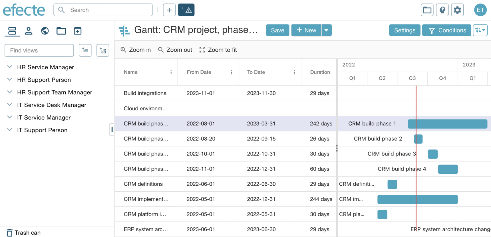

# A new way to visualize data - meet the new Gantt view

**Källa:** https://community.efecte.com/t/x2hnrlb/a-new-way-to-visualize-data-meet-the-new-gantt-view
**Publicerad:** 2022-08-25T11:22:52.507Z
**Uppdaterad:** 2022-09-19T08:06:42.600000
**Författare:** 

---

A new way to visualize data - meet the new Gantt view

      
    
          
      

        
              Aki Koivukoski
            

            R&D
              Aki_Koivukoski
            updated 3 yrs agoMon, September 19, 2022 at 8:06 AM GMT+2
  

          2replies
        Glenn JäderlundEfecte Employee3 yrs agoWed, August 31, 2022 at 3:29 PM GMT+2
  
        

        
    

      
          

    
        
        
        
      

    

   The upcoming Efecte Service Management Tool 2022.3 release will introduce a brand new view type, a Gantt view, for visualizing data cards with a timeline.  
 The Gantt view can be used for a variety of use cases, e.g. Project management. For now, the new view type will be a read-only and supports only one template. To start utilizing the new Gantt view, the admin is required to set the platform setting  
gantt.enabled 
 to true. Note that the Gantt view will not be available on browsers on mobile devices.  
 At the same time, we are also piloting a new settings panel based on a new design with the Gantt view.  
 We are currently in the process of planning the next steps for extending the Gantt view. Plans will be shared later here in the Efecte Community. 
          
    
        IT Service Management
      
    
        Service Management Tool
      
    
  
  Like
  Follow
    
            13

## Bilder

