# ESM 2022.2: Summary of upcoming UI improvements

**Källa:** https://community.efecte.com/t/60hb749/esm-2022-2-summary-of-upcoming-ui-improvements
**Publicerad:** 2022-05-19T08:31:25.020Z
**Uppdaterad:** 2022-08-25T13:27:00.717000
**Författare:** 

---

ESM 2022.2: Summary of upcoming UI improvements

      
    
          
      

        
              Jonne KaukoProduct Manager
            

            Senior Product Manager & Product Lead, M42 Core & Pro
              Jonne_Kauko
            updated 3 yrs agoThu, August 25, 2022 at 1:27 PM GMT+2
  

          19replies
        Aki Koivukoski3 yrs agoMon, August 8, 2022 at 3:53 PM GMT+2
  
        

        
    

      
          

    
        
        
        
      

    

  
  
    Summary of UI improvements - ESM 2022.2
  
  
  ContentsThe renewal of the user interface of the Efecte Service Management tool has been started with renewing the header bar and navigation panel!Refreshed header bar with a new featureNew navigation panel with tabs and filteringView and folder names: notes regarding the behavior of view and folders namesCreating new views  Creating new dashboardsNew window for organizing viewsDeleting views: a note regarding deleting viewsNew Customize user interface pageCustomization of the headerLogo uploadLogos: Note related to custom logos in ESM 2022.2 headerLogo indentationSearch AlignmentScrollbars: a note regarding the appearance of scrollbars in ESM 2022.2The renewal of the user interface of the Efecte Service Management tool has been started with renewing the header bar and navigation panel! 
  We are excited to introduce improvements to the way you work with ESM, starting with updates to the Header and Navigation. The header includes styling changes to simplify and modernize the look and feel. More importantly, you are now able to create a new data card from any template while on any page. The Navigation has had a more significant update, with improved features on how it is organized. Instead of having all the roles, folders, and views all in one list, there is now a more logical split to make it more manageable. We have also introduced the ability to perform a quick filter so you can search for a particular view without any need for scrolling. For administrators we have also included more options for customizing the look of ESM, enabling greater opportunity for you to brand it the way you want. The following sections provide a summary of the upcoming improvements.    
Refreshed header bar with a new feature 
          
 The header bar was refreshed for improving its usability and appearance. Also, a new feature is included: new data cards can be created directly from the header bar by using the dropdown menu, which is opened by clicking the + button (see screenshot below).  
 Customization options are also more flexible than ever! See more from the section New Customize user interface page.    
    
  
New navigation panel with tabs and filtering 
    
 The new structure and appearance make the navigation panel clearer and easier to use. As seen from the screenshot above, the appearance has been refreshed, and views are now grouped on tabs. Under the tabs, there is a search field. This makes it possible to filter views and makes it therefore easier to find the correct view. The filtering is applied to the currently selected tab, and the filtering applies to views (role names and view folder names are not filtered). Please note that the find field is not available on the Folders tab.   
 In terms of the visual appearance, the navigation panel has been redesigned for a fresh look and improved usability. A noticeable change is that the redundant role icons have been removed. Instead, there are arrow icons that show the user whether a role has been collapsed or uncollapsed (arrow down / up).      
 The old "+ New view" button and dropdown have been redesigned, and dashboards now have a dedicated button. Also, the trash can is now located at the bottom of the navigation panel instead of being represented as any other item in the navigation panel.   
 Summary of key improvements:  
 
 Views are now grouped on tabs 
   
   Role views 
   Personal views 
   Public views 
   Folders 
   Archive 
    
 The new find field makes finding the right view easier 
 
 
View and folder names: notes regarding the behavior of view and folders names 
 The behavior of long view and folder names will change in the new navigation panel. Previously, long view and folder names were cut, in case they did not fit into the width of the navigation panel (which was resizable also previously). In the context of the new navigation panel, long view and folder names will be wrapped into two lines. If the text does not fit regardless of wrapping it to two lines (if the name is long and the navigation panel width is set to narrow), the name will be cut. The full view name is shown within a tooltip.   
 
Creating new views   
    
 New views can be created by clicking the icon shown above. The functionality is similar to what it was before, but the appearance has been refreshed, and the dropdown menu utilizes the screen real estate better.       
     
Creating new dashboards 
  The options for creating dashboards are located under the "Create new dashboard" button. The functionality remains similar to what it was before.  
    
  
New window for organizing views 
  
 As part of the UI improvements, also a new organizing views window is introduced. Users can enter the window in two ways, depending on whether a) the user want to organize personal, public views, or views saved in the archive, or b) role views.   
  
 Entering the Organize views window for personal views, public views or archive views:   
     
 Entering the Organize views window for role views:   
     
 The example below shows the Organize views window for a role view:   
   
  
 
Deleting views: a note regarding deleting views 
 In order to simplify the appearance of the navigation panel, the functionality for removing views is moved to the new "Organize" dialog. The organize views menu can be accessed from the button shown next to the role name, when hovering on the role in the navigation panel. In the case of Personal views, the "Organize views" button is located next to the tabs, on the top of the navigation panel.   
    
  
New Customize user interface page 
    
 The new Customize user interface includes a lot of new customization options. There are separate sections for customizing the header, navigation panel, and main view. The Customize user interface page can be found by navigating to Administration (the cogwheel in the upper right corner) --> Maintenance --> System settings -->  Customize user interface. Root user level is required for accessing the administration, including this page.   
 The page also includes several previews: you can see what the changes will look like in various UI components.   
Customization of the header 
Logo upload 
 Custom logos can be uploaded from the Customize user interface page. The logo upload feature is more flexible than before: the scaling is done automatically, which removes the need of uploading a file of a specific size. Additionally, the logo positioning is improved: the logo will utilize all the vertical space of the header bar and will reach the far left end of the header. For indentation of the logo, see the next section.   
 The supported file format is PNG, as before. Now that the custom company logo import is done via the Customize user interface face, the separate Import custom company logo page is removed.    
 
Logos: Note related to custom logos in ESM 2022.2 header 
 As the logo scaling and enhanced positioning of the logo is introduced in Efecte Service Management Tool 2022.2, actions might be required from the administrator. Since the available area for logos will be expanded so that the whole vertical space on the header bar will be utilized for the logo, existing logos with size 140*40 or 140*60px will be expanded to fill the whole available space.   
 Due to that, existing logos might appear differently than before, and therefore it is recommended to pay attention to how your custom logo appears in the test environment after the upgrade to ESM 2022.2, and replace the logo if needed. The action must be done for all environments (development, test, and production).   
 
Logo indentation 
 With the new logo indentation setting, it is possible to adjust the horizontal indentation of the logo. It is possible to define the indentation in pixels from the left side.   
Search Alignment 
 The alignment of the global search, including the Create new... (Add) buttons, can be adjusted. The options include alignment to the left and a centered alignment.    
  
 
Scrollbars: a note regarding the appearance of scrollbars in ESM 2022.2 
 It is noteworthy that in ESM 2022.2, the appearance of the scrollbars will depend on the browser. In some browsers, the scrollbar might be thicker or thinner than in others, and that might cause variation in the appearance of the navigation panel. This might result in slight variations in the gap between the navigation panel's colored area, and the scrollbar.   
 In order to ensure a consistent user experience, we are investigating the options of determining the appearance of the scrollbars across the whole application. Therefore, the topic of scrollbars will be revisited once we are proceeding with the renewal for other areas in the UI.  Below you can find an example of how the scrollbars appear when using Firefox as browser.   
    
    
  

          
    
        Service Management Tool
      
    
  
  Like
  Follow
    
            13

## Bilder

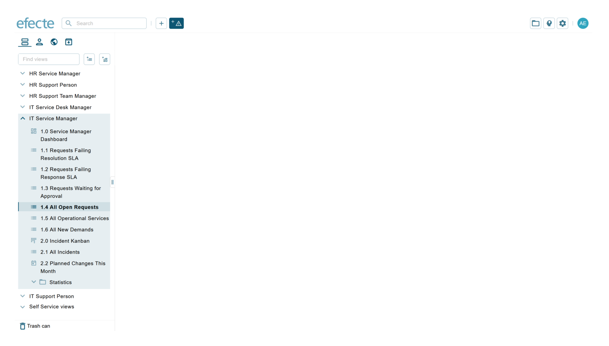

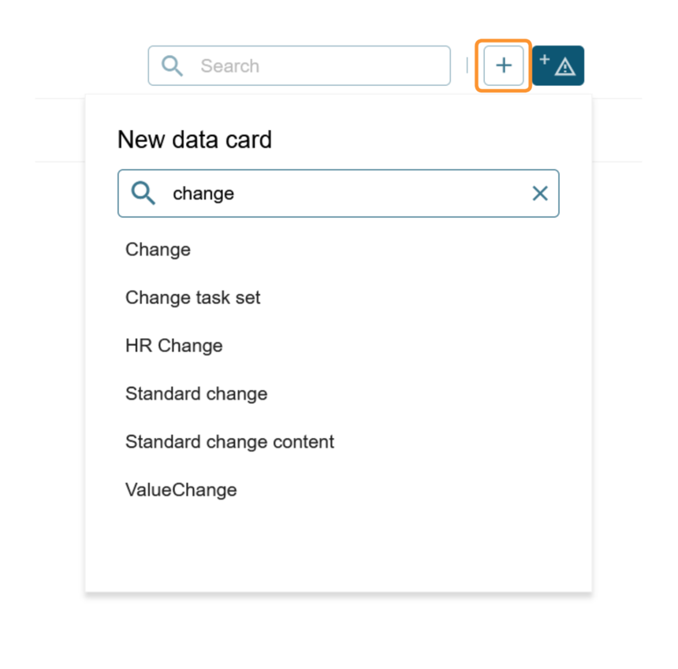

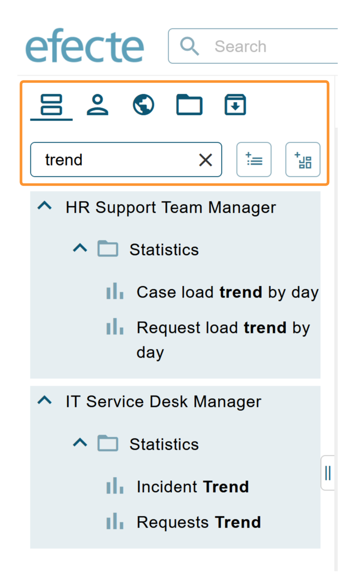

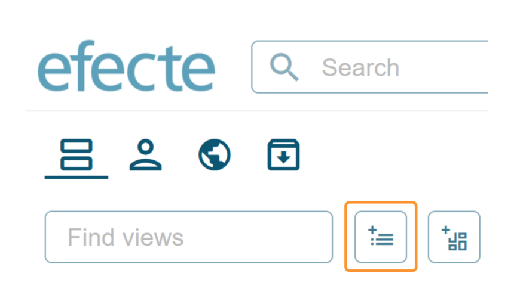

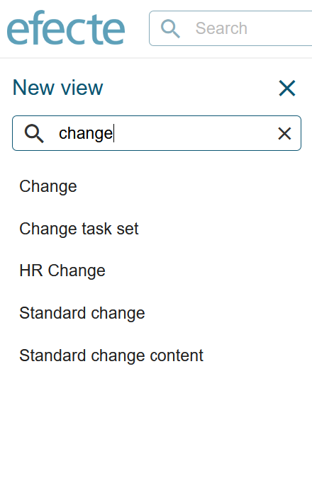

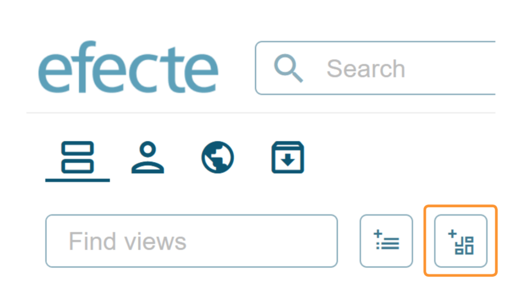

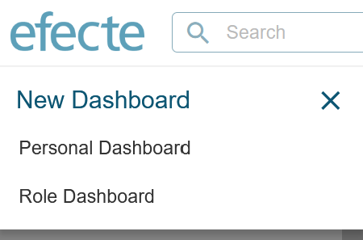

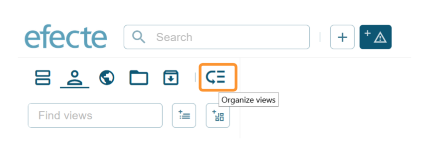

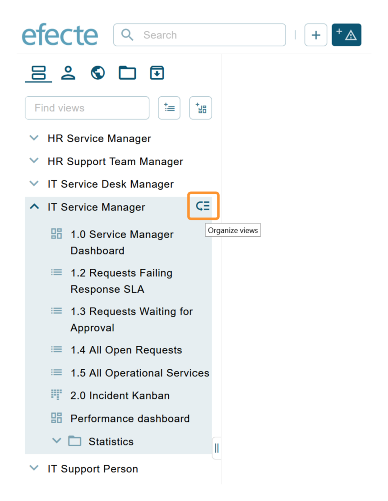

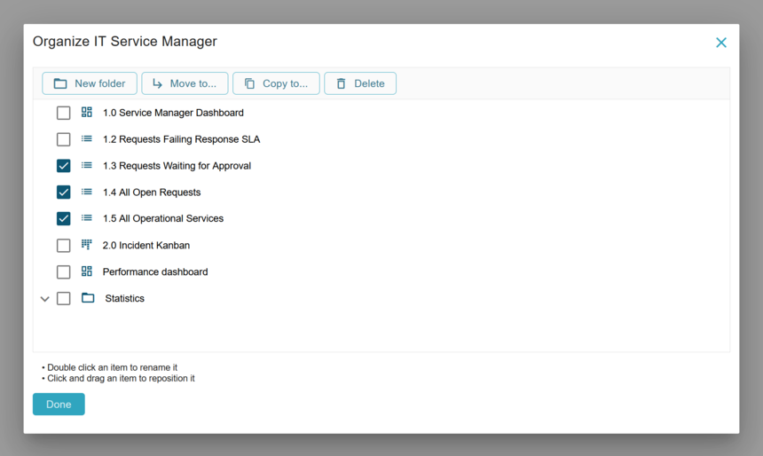

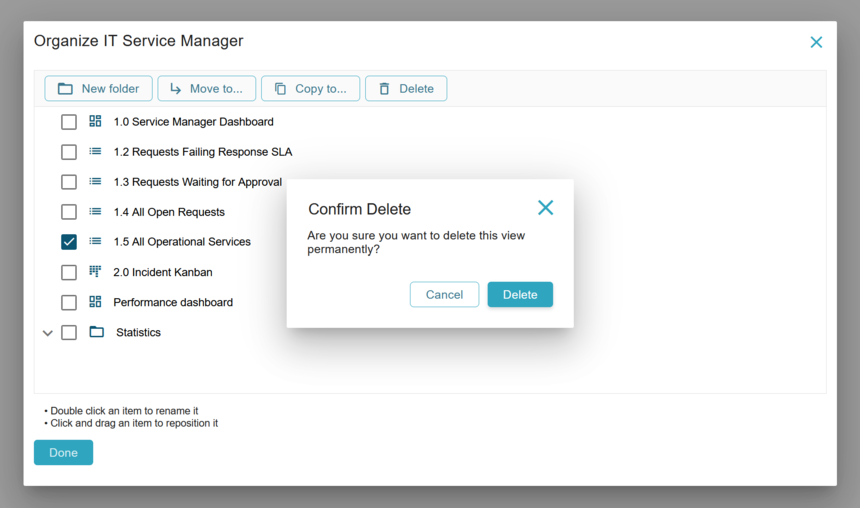

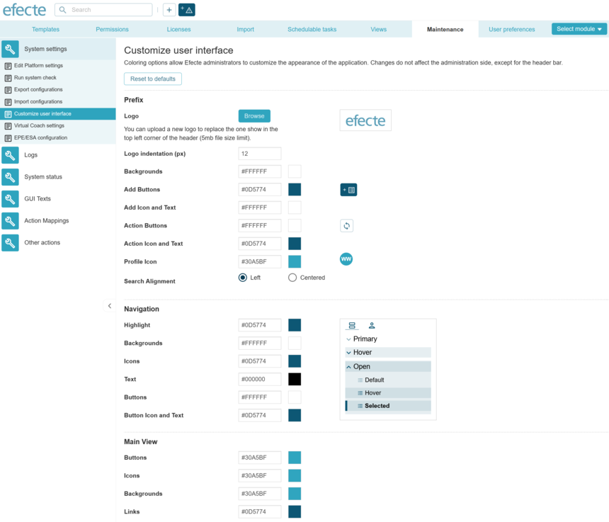

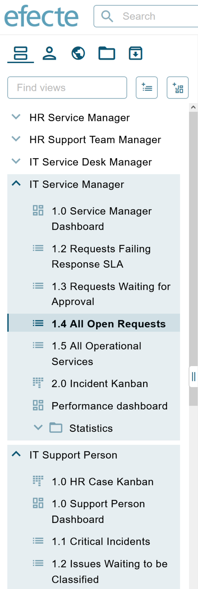

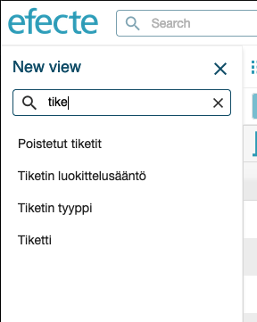

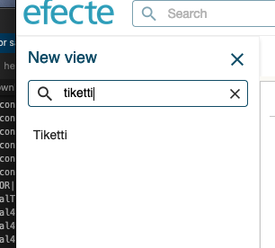

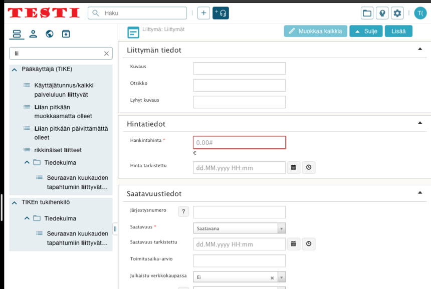

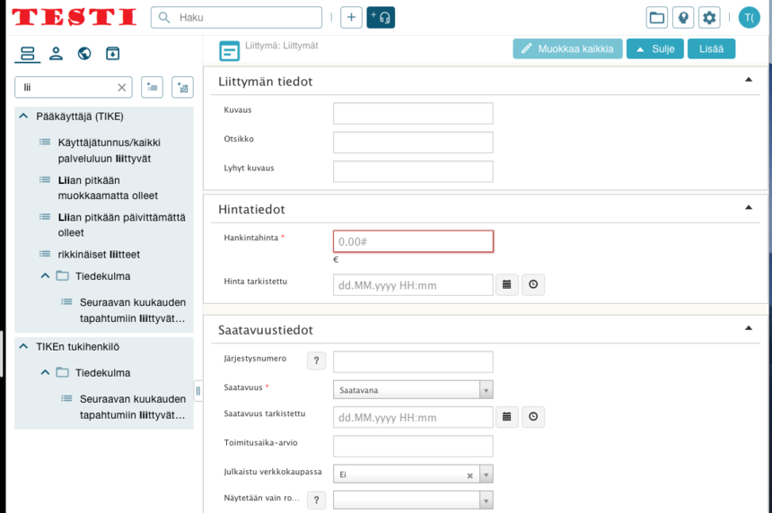

