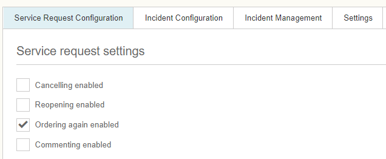
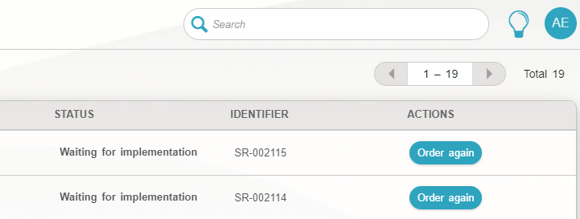

# ESS: Ordering again feature for service requests

**Källa:** https://community.efecte.com/t/60hagp8/ess-ordering-again-feature-for-service-requests
**Publicerad:** 2023-02-27T07:41:46.833Z
**Uppdaterad:** 2023-02-27T08:41:46.833000
**Författare:** 

---

ESS: Ordering again feature for service requests

      
    
          
      

        
              Juha HänninenProduct Owner
            

            ESM Product Owner
              Juha_Hanninen.1
            2 yrs agoMon, February 27, 2023 at 8:41 AM GMT+1
  

          

        
    
 In ESS 2023.1, we are introducing a new feature for ordering previous service requests again to make it simpler for the end users to order repeating requests.  
 The feature allows the end user to use a pre-populated form with the values that were used in their last order. Users can then review the form as usual and make any changes if needed. The feature also supports guided offerings and multi-item orders.  
 To enable the new feature, there is a new setting in the Support channel Service request settings: "Ordering again enabled" checkbox.  
     
 When enabled, Reorder button can be found for eligible requests in My Requests. Reorder functionality is hidden if the service configuration underneath is changed too much. The setting is disabled by default.  
    
 Ordering again when services contain new service items or additional information fields:  
 Ordering again will be available for services, even if new items or additional information fields have been added to the configuration. Any field that does not have a value in a previous order will not be populated automatically. New fields added to the configuration after the original order do not prevent ordering again unless the new fields are mandatory.  
 "Order again" is available only for eligible requests in My Requests that meet the following criteria:  
 
 Service item still exists in the catalogue. 
 For a guided offering: All previously ordered service items still exist in the catalogue and are part of the guided offering. 
 For a multi-item order: All previously ordered service items still exist in the catalogue. 
 User still has access to the related service item(s) 
 The service item uses an EFECTE-type Support channel. 
 
 When reordering, fields used in the previous order are pre-populated with the values of the prior order.  
 There are differences in how different field types are populated on the form:  
 The following field types are populated with previously used values if the field and value are still available:  
 
 MyService 
 Text field 
 Text area 
 Checkbox 
 Dropdown 
 Forms 
 
 Default values are used if previous values are not available.  
 The following fieldtypes are not populated based on the previous order:  
 
 Date 
 Attachments 
 
 Known limitations:  
 If the previous order contained multiple items, but now only one is allowed (i.e., the Item quantity setting was disabled afterwards), reordering is still available. The new order will include the number of items that were in the original order. 
          
    
        Self-Service Portal
      
    
  
  Like
  Follow
    
            1

## Bilder

