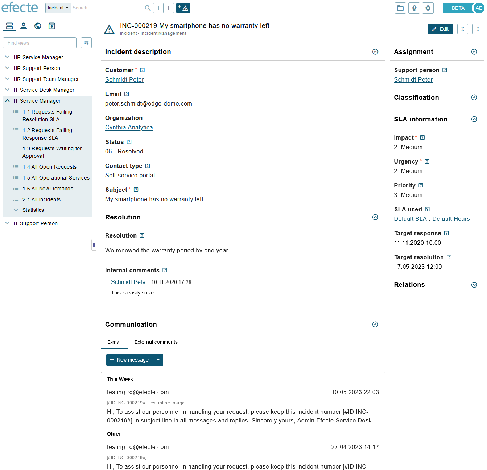
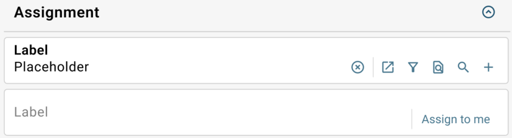
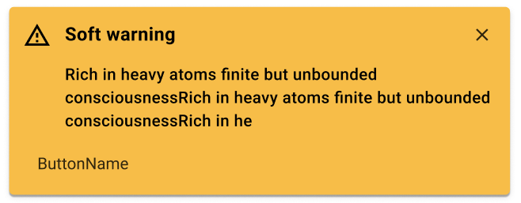
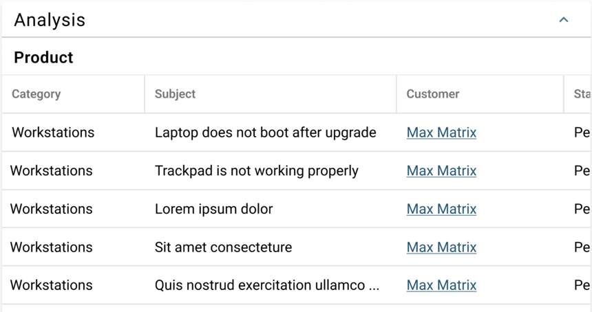
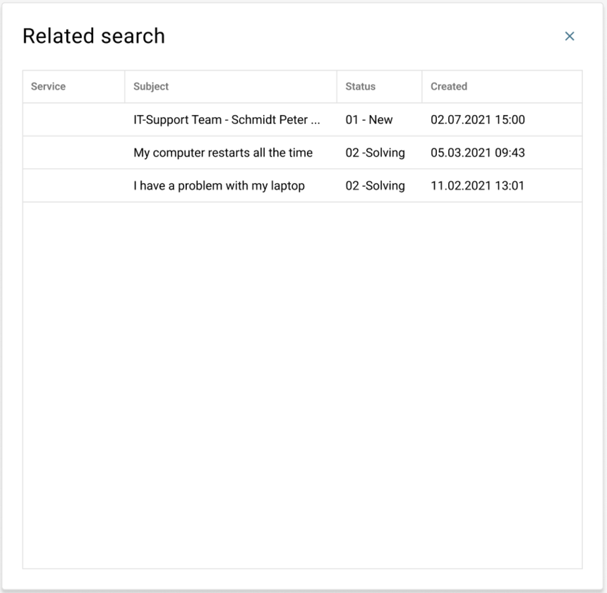
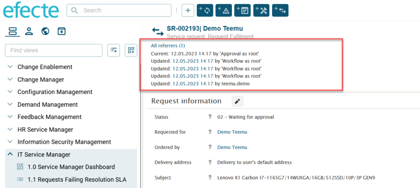
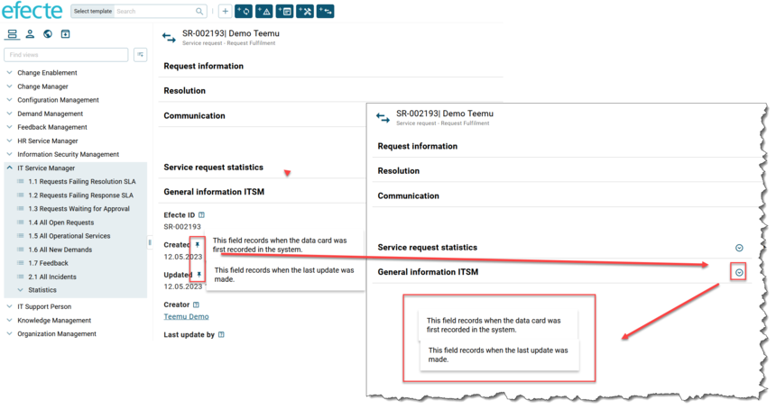

# Give us feedback to the early access beta version of the datacard view!

**Källa:** https://community.efecte.com/t/83h4y99/give-us-feedback-to-the-early-access-beta-version-of-the-datacard-view
**Publicerad:** 2023-05-11T07:08:00.000Z
**Uppdaterad:** 2023-12-19T13:33:29.580000
**Författare:** 

---

Give us feedback to the early access beta version of the datacard view!

      
    
          
      

        
              Jonne KaukoProduct Manager
            

            Senior Product Manager & Product Lead, M42 Core & Pro
              Jonne_Kauko
            updated 2 yrs agoTue, December 19, 2023 at 1:33 PM GMT+1
  

          8replies
        Jonne KaukoProduct Manager1 yr agoMon, May 6, 2024 at 12:29 PM GMT+2
  
        
        

        
    

      
          

    
        
        
        
      

    

  ContentsIncluded functionalitiesExamples of functionalities to be implemented in future versionsThe Efecte Service Management Tool 2023.2.0 introduced an early access beta version of the new user interface (UI). It includes a new beta version of the datacard view and list view.

Instructions for enabling the early access beta UI can be found in the 2023.2.0 release notes and the admin manual.

In the comments of this community post, you can give us feedback regarding the datacard view. We highly appreciate your input since it helps us to provide the best possible user experience for the end users in the future!
Please see more details below on the scope - it’s easier to give feedback once the scope is known! More information is available here: https://community.efecte.com/t/q6hc2vj/sneak-peek-to-the-new-data-card-view
The early access version of the datacard view intends to give a preview to the upcoming datacard view. It is released quite early in terms of feature coverage in order to be able to iterate the design based on user feedback. Therefore, what you see in ESM 2023.2.0, is not the “final” version of the datacard view. We’re currently in the process of iterating the design, and that continues based on your input.
The following table shows examples of features available in the 2023.2.0 version. The next table includes examples of functionalities that are not in the scope of 2023.2.0 but which are to be implemented in future releases.
For feedback related to the list view, please see this post: https://community.efecte.com/t/p8h4qd9/give-us-feedback-to-the-early-access-beta-version-of-the-list-view
Included functionalities

 
  
   Included functionalities
   Description
  
  
   Support for all datatypes in view mode and all datatypes except external reference in edit mode
   
    
     String
      
       String attributes, as also other attribute datatypes, now extend to the right-hand side of the class, allowing users to see more content in the attributes. 
       HTML-formatted outputs are not supported in this version.
      
     Text
      
       The text attributes are now larger and extend even larger when expanded by the user. When expanded, the attribute extends down to the page bottom.  
       HTML-formatted outputs are supported in this version with Expression handler, once the "Expression result is HTML" handler metadata is enabled. 
      
     Date
      
       New date picker for selecting the date. There is an embedded button for date picker. 
      
     Date/time
      
       New date picker for selecting the date. New time picker for selecting the time. Embedded buttons for the pickers.   
      
     Number
     Reference
      
       Embedded action buttons inside of the attribute.  
       Multivalues are presented as 'pills'.
      
     Back-reference
     Partially supported datatypes
      
       Decimal number (view only)
       External reference (view only) 
      
    
  
  
   Support for various handlers. The list is not exhaustive, and only includes handlers that have UI implications.
   
    
     AttributeCombiner
     AutoMailSender
     BusinessHoursFinder
     BusinessTimeBetween
     ChangeStamp
     CreationStamp
     CreatorStamp
     DatacardHiddenState
     DirectLinkGenerator
     FileUpload
     IDGenerator
     MonitoringStamp
     SLAFinder
     WorkflowStatusHandler
     Partially supported handlers
      
       Expression (No HTML formatting for string attributes)
       SLADeadline (customDeadline is not supported)
      
    
  
  
   Support for Progressbar attribute metadata
   The Progressbar handler metadata is supported. Please note that the Decimal number datatype is supported only in view mode in ESM 2023.2.0. Example of an decimal number attribute with the Progressbar metadata enabled and configured: 
  
 

Examples of functionalities to be implemented in future versions

 
  
   Examples of functionalities to be implemented in future versions
   Description of functionalities to be implemented in future versions
  
  
   Email capabilities
   The ESM 2023.2.0 includes an early development version of the EntityStateMail handler in the beta UI. The purpose of the development version is to give an overview of the upcoming implementation and allow iterative development based on user feedback. Upcoming development items include support for rich text in emails, new styling, attachment handling, and several other improvement areas.
  
  
   Commenting capabilities
   The ESM 2023.2.0 includes an early development version of the Worklog handler. The current version of the Worklog handler shows existing Worklog comments in view mode. Upcoming development items include the capability to add comments, support for rich text, styling improvements, and other improvement areas. The featureset of the Worklog handler remain as in the classic UI. The TextNote handler is sometimes used for internal comments. The future development plans also include support for the TextNote handler both with and without rich text. Future development plans include also support for the new Comment handler, which facilitates commenting with Efecte self-service 2 (ESS2).
  
  
   Support for other handlers
   Other handlers:
    
     CategoryDropdownReference
     Quickfill
      
       The Quickfills is planned to be applied straight away upon selection, without the user having to separately press a button to apply the quickfill.
      
     ReferenceCopy
     TicketReservation
     
    
     ValueButtonHandler
     
    
     ValueChangeMonitor
    
  
  
   Conditional attributes ('Enable if')
   Support for conditional attributes ('Enable if'), which allow admins to enable/disable attributes based on parent static string attribute values, is included in the future development plans for the beta UI.
  
  
   Support for datacard validations based on attribute values
   Datacard validations are used for instructing users and ensuring data quality. The future development plans include support for validations executed with datacard listeners (AlwaysFailDatacard action) and the Validator handler. The validation messages are to be shown in an unified manner (currently the outputs differ between the aforementioned methods). The validation messages generated by the Validator handler will be shown in a notification instead of inline in the datacard view. Potential HTML formatting of the validation messages will be sanitized, since only plain text formatting is used in the notifications. The notification messages will be yellow-colored instead of the red/orange notifications. The purpose of the change is to make the notification more friendly for the end users (orange or red messages can be perceived as severe errors, which validation messages aren’t). 
  
  
   EQL filters in reference and back-reference attributes
   Support for EQL filters in reference and back-reference attributes are included in the future development plans. There are no planned changes in the functionality.
  
  
   Reference tables (“Show selected values of referred template” setting)
   Support for reference tables in the datacard view is included in the future development plans. The reference tables are also going to be used with the EntitySearch and ValueChangeMonitor handlers.  
  
  
   Support for related search
   Future development plans include support for related search in reference attributes. 
  
  
   Support for the datacard view on mobile devices
   Future development plans include a mobile-optimized styling of the datacard view, to allow users to use the datacard view on mobile devices.
  
  
   Support for general attribute metadata
   Future development plans include supporting relevant general attribute metadata.
  
 

These lists are not exhaustive, but we hope these give you an overview of the scope! Thank you in advance for your feedback!
          
    
        Service Management Tool
      
    
  
  Like
  Follow
    
            3

## Bilder

