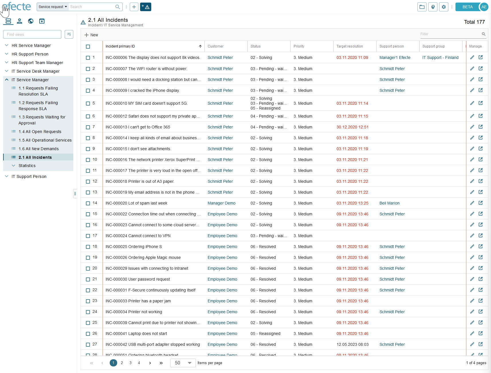
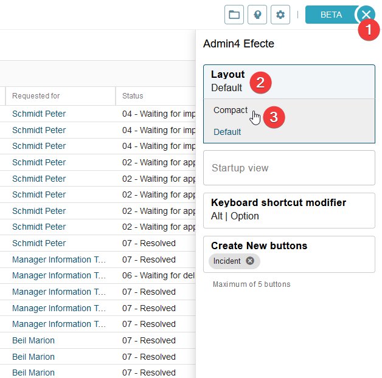
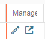
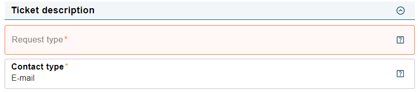

# Give us feedback to the early access beta version of the list view!

**Källa:** https://community.efecte.com/t/p8h4qd9/give-us-feedback-to-the-early-access-beta-version-of-the-list-view
**Publicerad:** 2023-05-08T14:39:48.473Z
**Uppdaterad:** 2023-06-20T15:24:49.003000
**Författare:** 

---

Give us feedback to the early access beta version of the list view!

      
    
          
      

        
              Jonne KaukoProduct Manager
            

            Senior Product Manager & Product Lead, M42 Core & Pro
              Jonne_Kauko
            updated 2 yrs agoTue, June 20, 2023 at 3:24 PM GMT+2
  

          17replies
        Viktor Kladt2 yrs agoWed, July 5, 2023 at 11:23 AM GMT+2
  
        
        

        
    

      
          

    
        
        
        
      

    

  ContentsIncluded functionalitiesFunctionalities planned for future versions The Efecte Service Management Tool 2023.2.0 introduced an early access beta version of the new user interface (UI) 🤩 It includes a new beta version of the list view and datacard view.  
 
 Instructions for enabling the early access beta UI can be found in the 2023.2.0 release notes and the admin manual.  
 In the comments of this community post, you can give us feedback regarding the list view. We highly appreciate your input since it helps us to provide the best possible user experience for the end users in the future!  
 Please see more details below on the scope - it’s easier to give feedback once the scope is known! Please also see the ESM 2023.2.0 release notes for more details.  
 The early access beta version of the new list view focuses on basic functionality and data consumption instead of administration and modification. The new UI is released early in terms of maturity, as an early access version, to allow iterative development based on user feedback. Therefore, the early access version does not yet include all existing features.  
 The following table shows examples of features available in the 2023.2.0 version. The next table includes examples of functionalities that are not in the scope of 2023.2.0 but which are to be implemented in future releases.  
Included functionalities 
 
  
   
     Included functionalities   
     Description   
   
   
     Creating new datacards from the list view   
     Users can create new datacards from the list view by clicking the + New button.   
   
   
     Adjusting columns by dragging and double-clicking   
     Width adjustments are saved for saved role views and personal views. Width adjustments are not saved for new unsaved list views.   
   
   
     Various options for opening and editing datacards from the list view   
     By using the ‘Manage’ panel on the right side of the list view:  
     
       Open in edit   
       Open in new tab   
      By using the context menu (right-click on a row):  
     
       Open   
       Edit   
       Open in new tab   
       Edit in new tab   
      
   
   
     Filtering of items   
     Users can filter the datacards shown in the list view.   All datatypes, except date and date/time, are supported. Multilanguage values are supported.    
   
   
     Fixed headers and columns   
     Users can see the column header (attribute names), the number column, and the Manage panel all the time when scrolling vertically and horizontally.   
   
   
     Primary and secondary sorting of rows based on columns   
     Users can change the sorting by clicking on the column headers and add secondary sorting by pressing CTRL and clicking the column headers.   
   
   
     Changing pages and selecting the number of items per page   
     Users can change pages and change the number of datacards shown in the list view.   
   
   
     Icons for unread emails (EntityStateMail) and unread comments (Worklog)   
     Users can see icons when there are unread emails (EntityStateMail) and unread comments (Worklog), when the corresponding attributes are shown as columns in the list view.   
   
  
 
Functionalities planned for future versions 
 
  
   
     Examples of functionalities planned future versions   
     Description   
   
   
     Changing view settings and conditions   
    
     
       Changing view settings (visibility state, modules, folders etc.)   
       Changing view conditions   
      In 2023.2.0, the views in the early access beta UI are based on the views settings and conditions defined in the classic UI.   
   
   
     Modifying list views and saving them   
    
     
       Adding columns   
       Removing columns   
       Changing the order of columns   
       Saving list views   
      
   
   
     Editing datacards through the list view   
    
     
       Multi-editing datacards   
       Deleting datacards   
       Moving datacards to other folders   
       Duplicating datacards   
      
   
   
     Exporting datacards to excel   
     Exporting datacards to excel (.xls and .xlsl formats)   
   
   
     Creating graphs based columns   
     Creating graphs based on the datacards in a list view by clicking on an icon in the column header.   
   
  
 
 These lists are not exhaustive, but we hope these give you an overview of the scope! Thank you in advance for your feedback! 🤩 
          
    
        Service Management Tool
      
    
  
  Like
  Follow
    
            13

## Bilder

