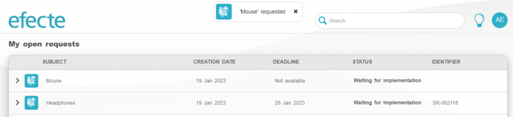
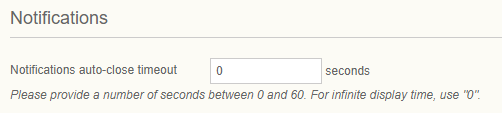

# Improved notification popup for ESS upcoming in 2023.1

**Källa:** https://community.efecte.com/t/35h0bck/improved-notification-popup-for-ess-upcoming-in-2023-1
**Publicerad:** 2023-01-19T15:05:29.010Z
**Uppdaterad:** 2023-01-19T16:05:29.010000
**Författare:** 

---

Improved notification popup for ESS upcoming in 2023.1

      
    
          
      

        
              Juha HänninenProduct Owner
            

            ESM Product Owner
              Juha_Hanninen.1
            3 yrs agoThu, January 19, 2023 at 4:05 PM GMT+1
  

          

        
    
 Last year, we introduced a new confirmation window for ESS, that could also accommodate issues with long error texts and accessibility deficiencies. However, usability has suffered due to this change, and based on received feedback we are now improving the notification window with one that does not require any action from the user, and can be configured to be closed automatically.   
    
 Setting for adjusting the auto-close time of the window will be available on ESS admin settings tab.  
   
  
 The new confirmation window will be available on Efecte 2023.1 
          
    
        Self-Service Portal
      
    
  
  Like
  Follow
    
            4

## Bilder

