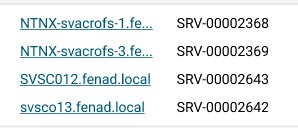
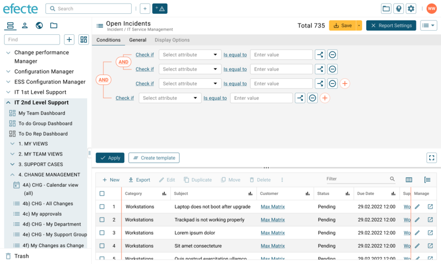

# Improvements to the List view

**Källa:** https://community.efecte.com/t/60h7wsp/improvements-to-the-list-view
**Publicerad:** 2022-10-12T11:21:24.093Z
**Uppdaterad:** 2023-03-27T13:32:10.117000
**Författare:** 

---

Improvements to the List view

      
    
          
      

        
              Nick BoettcherEfecte Employee
            

            Efecte Product Designer
              Nick_Boettcher
            updated 2 yrs agoMon, March 27, 2023 at 1:32 PM GMT+2
  

          8replies
        Jonne KaukoProduct Manager3 yrs agoThu, December 22, 2022 at 10:37 AM GMT+1
  
        

        
    
 Currently, underway is a redevelopment of the list view - the main interface a lot of you use for viewing your data. With that in mind, we want to make it easier and quicker to use so you can get more out of it . This is an important piece of work and starts the journey for making ESM a product that works better for you. I thought I would take the opportunity to provide you with insight into what we are doing so you can see what is coming up. We've had conversations with many people as part of our process, helping us address the issues you might have with the current List view, and validate that we are making useful improvements. You're also welcome to comment on this article to keep that feedback coming in.  
  
 The interface  
   
 The main interface will host a restyling of the list, and a tidier presentation of the buttons contained in the view header. Settings and Conditions are now accessed via one button – “Report Settings” – which will open the settings window panel while still being able to see, and interact with, the list itself. As has already been released, the View types (list, chart, Kanban, etc) is simplified to one button that opens to show you all the options, taking up less space in the view.  
  
 New and improved Features  
  
 Adjustable columns  
 You can resize the columns to suit how you want to view the data. If you have permission to save the view, the column widths will also be stored so they are the same when you come back.  
  
 Sticky header  
 When you scroll down the list, the header will now “stick” to the top so that you do not lose context of what data is shown in a column.  
  
 Opening a Datacard  
 Clicking on a row will open the associated Datacard in the current window. We have also introduced a column called “Manage” that stays in place while scrolling horizontally. There are two actions here  
 1) open the Datacard in Edit mode  
 2) Open the Datacard in a new browser tab.  
     
  
 Attribute path  
 In the column header you can now see as much of an attribute path as we can show, with the first and last part of the path visible at the very least. The full path will be displayed as a tooltip when the cursor is over the column header. This feature will make it easier to distinguish between two attributes that have the same name.  
  
 Multi-value references  
    
 A cell containing multi-value references will now be easier to read. If the data in a cell has the same parent attribute as the data in another cell, each value will be aligned to its respective value in another cell. You will tell by the column header if cells are linked by the same parent.  
  
 Also, if two columns are based on reference paths, the data shown in the columns will be sorted similarly for all columns based on the same parent attribute. This helps the user to associate the data in one column with data from other columns with the same parent.  
  
 Search Results   
 Search results from global searches or multi-template views will be presented as tabs. This will make it quicker and easier for you to find the information from various templates.   
  
 Compact Mode  
 We haven’t forgotten it! For those who like to see more on-screen, the Compact Mode has improved features. All elements within the table will scale appropriately so that everything fits perfectly.  
  
 Conditions  
   
 The presentation of the Conditions has had a redesigned, making it easier for you to see the relationships between each query. Each line will read more like a sentence, so you have a better idea of what each condition does. We are investigating the feasibility of being to reposition conditions so you can adjust as you go along.  
  
 Saving  
 Providing you have permission, when you save a view (settings, conditions, layout), it will overwrite what already exists, as happens with all modern software. If you want to save a copy, there is a “Save as…” option, enabling you to specify a new name and location.  
  
 So what do you think? Once we are closer to release, we will run an in-depth review of all the features in an online presentation. In the meantime, you are welcome to ask questions and share your thoughts. I guess an important thing to note is that you will not have to make any changes to your configuration and List-view settings – they will work as they are currently. 
          
  Like
  Follow
    
            30

## Bilder

