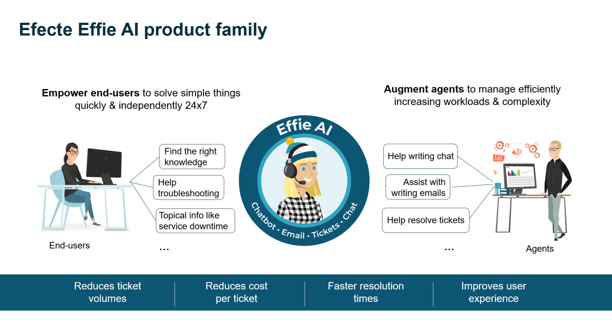
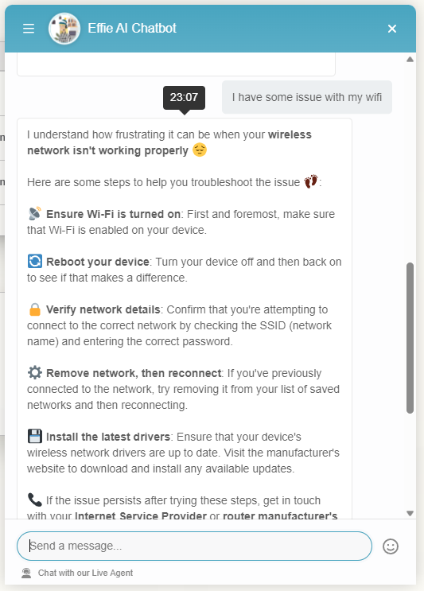
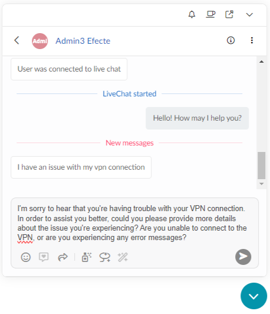
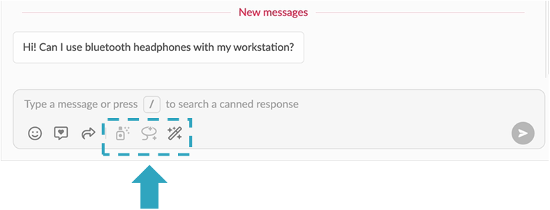
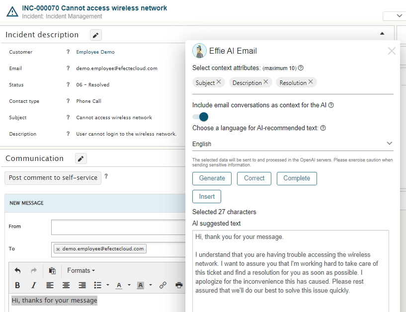
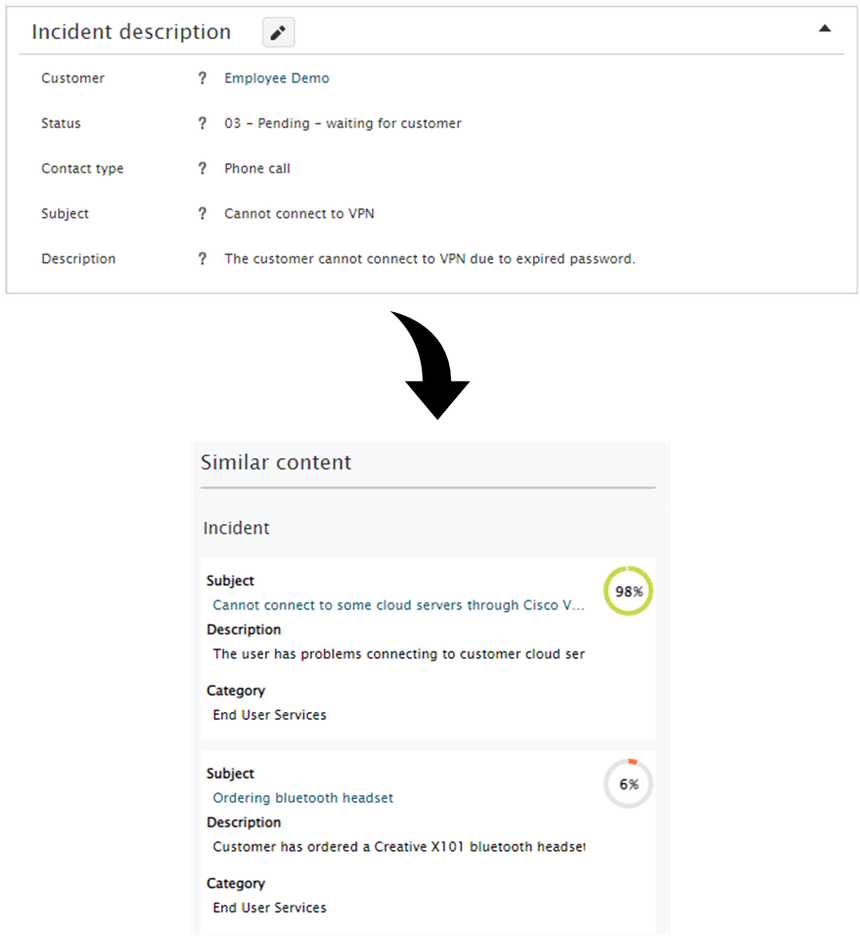
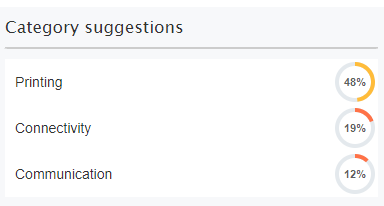
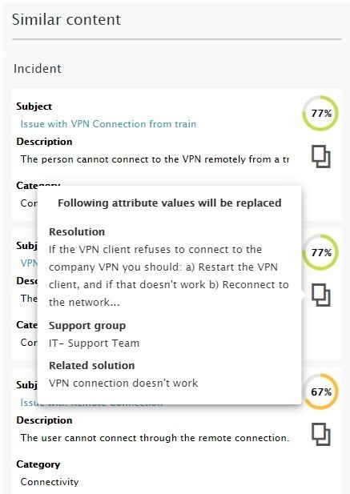

# Introducing Effie AI - The AI for Service Desk that keeps your data local

**Källa:** https://community.efecte.com/t/x2yq0r9/introducing-effie-ai
**Publicerad:** 2023-09-19T06:00:00.000Z
**Uppdaterad:** 2023-09-21T14:02:24.797000
**Författare:** 

---

Introducing Effie AI - The AI for Service Desk that keeps your data local

      
    
          
      

        
              Juha HänninenProduct Owner
            

            ESM Product Owner
              Juha_Hanninen.1
            updated 2 yrs agoThu, September 21, 2023 at 2:02 PM GMT+2
  

          

        
    

      
          

    
        
        
        
      

    

  Contents Effie AI for End-usersEffie AI ChatbotEffie AI for AgentsEffie AI Chat Effie AI EmailEffie AI Ticket We are thrilled to announce the Effie AI product family, our latest addition to the Efecte portfolio, that brings Artificial Intelligence (AI) capabilities embedded in Efecte Service Management solutions.  
 Effie AI uses secure Generative AI and Natural Language Processing (NLP) technologies to empower Service Desk agents and help end-users solve issues quickly and at a lower service cost. With a choice of local or OpenAI models and private or public cloud data residency, Effie AI gives compliance-conscious European organizations the best of both worlds: productivity-boosting generative AI capabilities with complete control over the privacy and security of their data.   
 Effie AI helps agents manage increasing complexity and workloads efficiently by reducing resolution times and manual effort required for handling tickets.  
 In the race to digitalize and automate, the service desk must catch up, costing time and money. A massive 83% of end-user tickets are still handled manually by agents, even for low-level and repetitive issues. As well as hampering productivity, this keeps service costs high.  
 At the same time, users are increasingly happy to solve issues with the help of an intelligent chatbot. It's now the #5 most preferred method out of 12, up from #10 in 2020, reflecting growing levels of comfort with digital self-service and familiarity with AI virtual assistants.  
 There is a strong case for using generative AI to help users solve issues independently and agents to be more productive. However, some organizations are concerned about entrusting sensitive data to a “black-box” cloud-based AI tool that might be stored overseas and used to train large language models (LLMs).  
 Effie AI product family includes Effie AI for End-users and Effie AI for Agents. Effie AI for End-users empowers users to solve simple issues on their own, quickly, 24x7. Effie AI for Agents helps agents to manage increasing complexity and workloads efficiently.  
 Effie AI reduces ticket volumes and cost per ticket, helps get faster resolution times, and improves the overall user experience for end-users and agents.  
 Effie AI for End-users 
 Effie AI allows end-users to solve different issues independently and quickly find what they want, 24x7.  
 Effie AI for End-users includes Effie AI Chatbot, NLP-based and rule-based Chatbot, and Live Chat.  
    
Effie AI Chatbot 
 Effie AI Chatbot can understand user messages and answer with predefined, curated responses. Effie AI Chatbot uses Natural Language Processing, guaranteeing that every user can get support fast. Effie AI can interpret user questions and provide valuable answers, guide users to additional resources, or help escalate the issue to live support agents.  
Effie AI for Agents 
 Effie AI helps agents manage increasing complexity and workloads efficiently by reducing resolution times and manual effort required for handling tickets. It includes Effie AI Chat, Effie AI Email, and Effie AI Ticket.  
Effie AI Chat  
 Effie AI Chat allows chat support agents to utilize generative AI to form customer responses in seconds.   
   The generative AI capabilities allow agents to quickly respond to user messages, reducing service times and allowing them to serve more customers.  
 The following buttons are available for agents in the UI:   
 
 Generate - The agents can generate a new response from scratch 
 Correct -  The agents can fix typing errors or produce a more precise response with the Correct functionality. 
 Complete - The agents can complete their sentences with the Complete feature.  
 
   
Effie AI Email 
 Effie AI Email allows agents to communicate with end users efficiently, with less manual effort. Effie AI email can be easily accessed in the email editor by clicking the Effie AI button at the bottom.  
    
 Effie AI Email currently has three key features:  
 
 Generate: This allows agents to create a new message from scratch. Agents can get ready-made, generated responses by providing contextual data such as ticket subject or description as selections before they request the message to be generated. Additionally, the agent can define the language they want to receive the answer from a list of supported languages. 
 Correct: Agents can also use Effie AI Email for spell checking and correct any typing errors. First, they must select text in the email editor and then request the correction in the Effie AI Email window. 
 Complete: Agents can finalize any incomplete message with the Complete feature. Like with the Correct feature, the agent must select the text they wish to complete. 
 
Effie AI Ticket 
 Effie AI Ticket is the new name of the feature previously known as Virtual Coach. It helps service desk agents find relevant information and utilize existing service management data more efficiently.  
 When enabled, Effie AI Ticket can be easily accessed in the top-right corner while working on a data card.  
    
 Currently, Effie AI Ticket can help agents with the following features:  
 
 Similar content provides ESM users with a list of items that Effie AI considers relevant for the open data card. Effie AI Ticket uses Natural Language Processing to find items in the Efecte platform that look similar to the open data card. This lets agents quickly find helpful information, such as previous root causes or resolutions. 
 
    
 
 Suggestions enable ESM users to classify data cards with, for example, category. Effie AI builds a statistical model from the existing data to suggest the most likely values for fast classification. 
 
    
 
 Copy fills data cards faster by copying multiple values from a Similar content item. This allows agents to reduce the manual effort to fill in details for repeating issues. 
 
   
          
    
        Effie AI
      
    
        IT Service Management
      
    
        Service Management Tool
      
    
        Virtual Coach
      
    
        Featured
      
    
  
  Like
  Follow
    
            6

## Bilder

