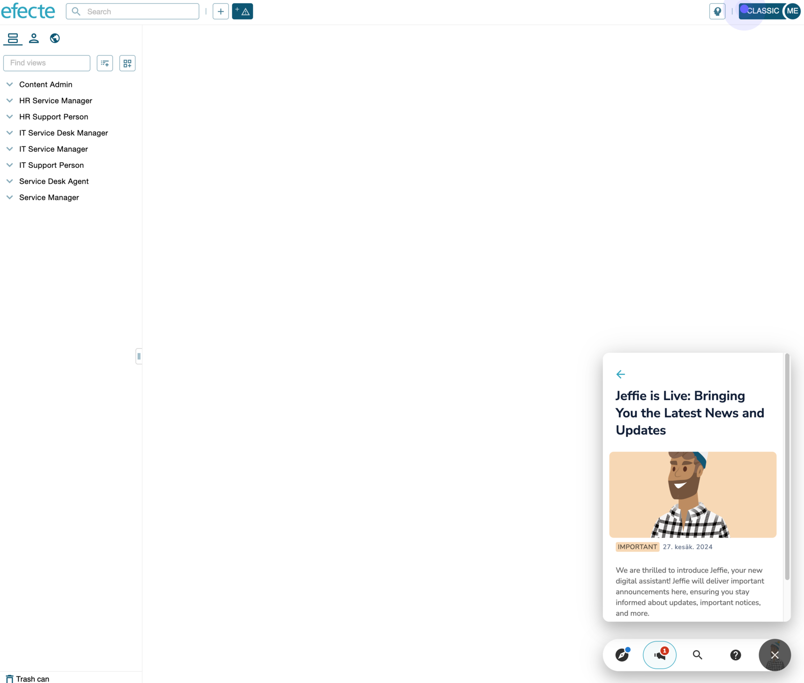
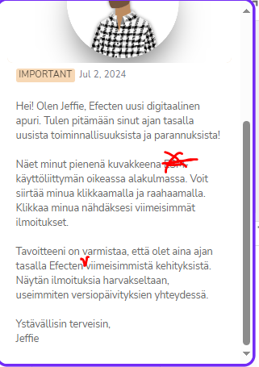
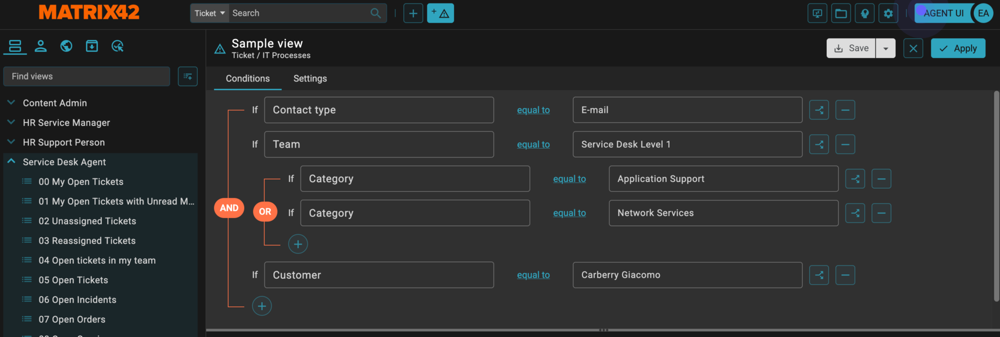

# Introducing Jeffie – Enhancing Communication and User Experience

**Källa:** https://community.efecte.com/t/h7ymnn4/introducing-jeffie-enhancing-communication-and-user-experience
**Publicerad:** 2024-06-27T09:20:24.817Z
**Uppdaterad:** 2024-10-10T12:45:42.037000
**Författare:** 

---

Introducing Jeffie – Enhancing Communication and User Experience

      
    
          
      

        
              Jonne KaukoProduct Manager
            

            Senior Product Manager & Product Lead, M42 Core & Pro
              Jonne_Kauko
            updated 1 yr agoThu, October 10, 2024 at 12:45 PM GMT+2
  

          30replies
        Janne Venäläinen1 mth agoThu, November 27, 2025 at 9:49 AM GMT+1
  
        

        
    

      
          

    
        
        
        
      

    

  ContentsIntroducing JeffieFrequently Asked Questions (FAQ)1. What is Jeffie?2. Why is Jeffie introduced?3. What can Jeffie do?4. In which products will Jeffie be available?5. Has Jeffie something to do with Effie?6. Will Jeffie be available in private cloud environments?7. Does Jeffie work in on-prem (Windows) environments?8. In which language will we publish announcements?9. Who to contact for more information?Introducing Jeffie
We are excited to introduce Jeffie, our new digital assistant, designed to revolutionize how we communicate with our customers and end users within the Efecte Service Management (ESM) tool. As part of our continuous effort to improve user experience and engagement, Jeffie brings a new level of interactivity and efficiency to our platform.
Over the years, we have explored various methods to ensure that our users are well-informed and aware of all the latest features and improvements. Traditional communication channels like newsletters and community posts, while useful, often fall short in reaching every end user and even administrator effectively. The lack of awareness sometimes results in a perception that the solution would not evolve fast enough. This causes unnecessary pressure on administrators from the users.   
To address this challenge, we're introducing Jeffie. Jeffie is designed to provide important announcements related to the Efecte ecosystem. For example, Jeffie will inform users about new features that can improve their efficiency and user experience.
Jeffie will be shown as a small icon in the bottom right-hand corner of ESM: 

If needed, users can move it to other locations on the screen. New announcements will pop up for users on predefined pages in the product. Users can also view the announcements in a list afterward.
Announcements will be published infrequently - typically around one or two notifications a month, with a few additional announcements after each release to highlight new features and improvements. Rest assured, we will not overwhelm you with constant notifications.
Moreover, Jeffie plays a crucial role in gathering feedback from end users. This feedback is essential for understanding user needs and continuously developing the user experience. By using Jeffie to collect feedback, we can ensure that our services are aligned with user expectations and make necessary improvements based on their input.
We'll start rolling out Jeffie to a limited number of environments in Finland starting in July. We are confident that Jeffie will significantly enhance how we communicate with the community of Efecte users and admins, providing a more seamless and engaging experience. Stay tuned for more updates as we continue to evolve and improve Jeffie’s capabilities!
Edit 10.09.2024: With the upcoming 2024.2 release, we are excited to expand Jeffie’s presence across all cloud environments. This update introduces multi-language support and enhances the way we communicate directly within the ESM tool. Jeffie will be enabled in December after all environments have been upgraded to the 2024.2 version.

Frequently Asked Questions (FAQ)
1. What is Jeffie?
Jeffie is a digital adoption platform that helps users navigate and utilize our software applications through interactive guides and on-screen walkthroughs. Initially, Jeffie will deliver important announcements directly to end users.
2. Why is Jeffie introduced?
Jeffie is introduced to enhance user experience by providing real-time announcements directly within the ESM tool. This helps keep users informed about updates, important notices, and other relevant information, thereby improving communication and user engagement.
3. What can Jeffie do?
Currently, Jeffie delivers important announcements to end users within the ESM tool. Future capabilities will include interactive guides, tooltips, beacons, and engagement measurement tools.
4. In which products will Jeffie be available?
Jeffie will be available in the Efecte Service Management (ESM) tool for delivering announcements. Future expansions may include guides and other interactive features.
5. Has Jeffie something to do with Effie?
No, other than that they are both Efecte brand figures (Effie & Jeffie). Effie AI is Efecte's AI product family, which includes a variety of AI features both for end users and agents.
6. Will Jeffie be available in private cloud environments?
In later phases, yes. However, Jeffie is first rolled out in standard cloud environments.
7. Does Jeffie work in on-prem (Windows) environments?
Jeffie will be available only in cloud and private cloud environments.
8. In which language will we publish announcements?
The language is determined based on the region of the Efecte customer tenant. Jeffie is first rolled out in Finnish to Efecte customers in Finland.
9. Who to contact for more information?
Please post your question as a reply to this community post.

 
We look forward to seeing how Jeffie enhances your experience with the ESM tool!

          
    
        Featured
      
    
        Service Management Tool
      
    
  
  Like
  Follow
    
            5

## Bilder

