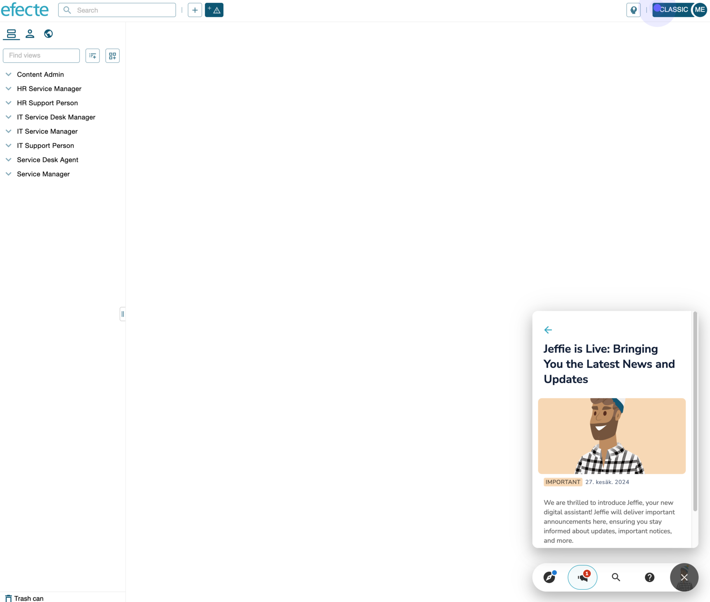
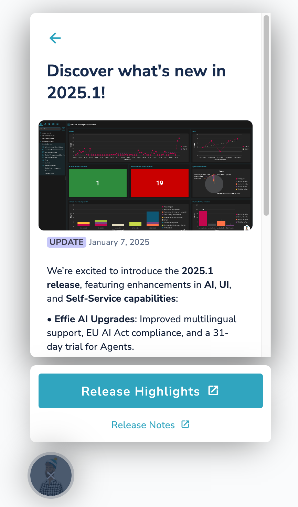

# Jeffie expands to international cloud environments with the 2024.2 release!

**Källa:** https://community.efecte.com/t/p8yltwt/jeffie-expands-to-international-cloud-environments-with-the-2024-2-release
**Publicerad:** 2025-01-07T10:10:00.000Z
**Uppdaterad:** 2025-09-15T14:03:33.013000
**Författare:** 

---

Jeffie expands to international cloud environments with the 2024.2 release!

      
    
          
      

        
              Jonne KaukoProduct Manager
            

            Senior Product Manager & Product Lead, M42 Core & Pro
              Jonne_Kauko
            updated 4 mths agoMon, September 15, 2025 at 2:03 PM GMT+2
  

          7replies
        Janne Venäläinen8 mths agoFri, May 9, 2025 at 1:02 PM GMT+2
  
        

        
    

      
          

    
        
        
        
      

    

  Contents📢 Reminder: Jeffie expands to international cloud environments with the 2024.2 release!🌍 Multi-Language Support🔔 Enhanced Communication for Admins👩‍💻 Support for Adopting the New Agent UI🗓 Timeline📜 Previous Announcements🌟 Progress So Far🤖 Has Jeffie something to do with Effie?🤔 What is it then in practice?✅ No Action Needed💬 Questions?📢 Reminder: Jeffie expands to international cloud environments with the 2024.2 release!
We’re thrilled to announce that Jeffie, our digital assistant, will soon be available across international cloud environments starting with the 2024.2 release! 🎉
Here’s what’s coming:
🌍 Multi-Language Support
Jeffie will now support multiple languages, making it easier for users in diverse regions to benefit from its capabilities. The language is determined based on the user's language setting. Supported languages include English, Finnish, German, and Swedish. Jeffie will default to English in case the user's language is none of these. 
🔔 Enhanced Communication for Admins
Currently, Jeffie is primarily used for enhanced communication with admins. It delivers crucial in-app notifications about updates, new features, and improvements directly within the ESM tool. This ensures admins stay informed, enabling them to implement changes efficiently and reduce pressure from end-users. Please note that Jeffie’s communication will primarily focus on release-related updates, ensuring the number of announcements remains limited and unobtrusive.
👩‍💻 Support for Adopting the New Agent UI
Moving forward, Jeffie will become a key tool for helping users adopt the new agent UI. While there is currently limited content for normal users in the classic UI, Jeffie will focus on guiding end-users through onboarding to the new Agent UI, showcasing new features, and demonstrating their value. This targeted support ensures a smoother transition and maximizes the benefits of the new updates.
🗓 Timeline
• Jeffie will be enabled earliest on 21.01.2025 after the 2024.2 product upgrades have been completed.
• These upgrades are required to ensure Jeffie’s seamless functionality in all environments.
📜 Previous Announcements
This is a reminder. News about Jeffie’s expansion was first shared in the October newsletter and later highlighted in the December release highlights (2025.1).
🌟 Progress So Far
Jeffie was initially rolled out during Summer 2024 to the majority of customers. This expansion applies only to international environments. Finnish environments where Jeffie is not currently enabled will not be included in this phase of the rollout.
This exciting update ensures better communication, smoother transitions, and a more engaging user experience for both admins and end-users. Stay tuned for more updates as we finalize Jeffie’s rollout! 🚀
🤖 Has Jeffie something to do with Effie?
No, other than that they are both brand figures (Effie & Jeffie). Effie AI is an AI product family, which includes a variety of AI features both for end users and agents. Jeffie is a virtual assistant and communication tool, which is not based on AI, and does not relate to Effie AI. 
🤔 What is it then in practice?
Jeffie is a user-friendly widget located in the bottom-right corner of the service management tool. It provides occasional, targeted notifications for administrators and users, sharing updates such as product news, feature announcements, helpful tips, and more.

✅ No Action Needed
The introduction of Jeffie does not require any action from admins or users. Jeffie is simply another way we’re improving our product communication to make staying informed easier and more seamless.
This exciting update ensures better communication, smoother transitions, and a more engaging user experience for both admins and end-users. Stay tuned for more updates as we finalize Jeffie’s rollout! 🚀
💬 Questions?
Feel free to reply to this post or contact our Service Desk if you need assistance. We’re here to help! 🚀
          
  Like
  Follow
    
            4

## Bilder

