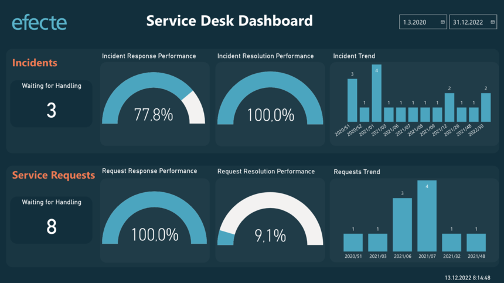
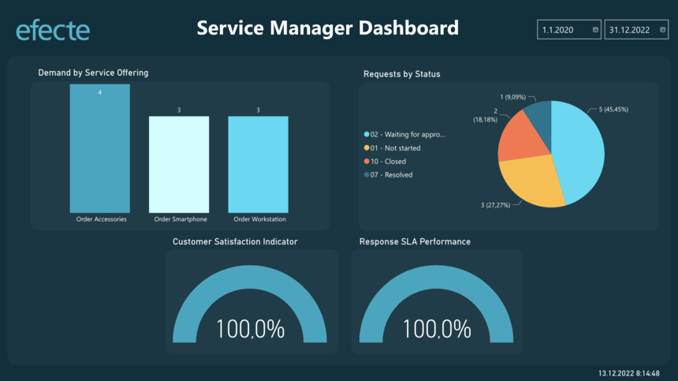
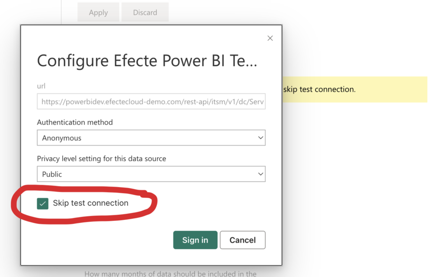

# Microsoft Power BI template

**Källa:** https://community.efecte.com/t/83h0xal/microsoft-power-bi-template
**Publicerad:** 2022-12-21T19:31:00.000Z
**Uppdaterad:** 2024-04-18T07:52:11.930000
**Författare:** 

---

Microsoft Power BI template

      
    
          
      

        
              Aki Koivukoski
            

            R&D
              Aki_Koivukoski
            updated 1 yr agoThu, April 18, 2024 at 7:52 AM GMT+2
  

          6replies
        Oskari Aaltonen2 yrs agoWed, February 8, 2023 at 1:15 PM GMT+1
  
        

        
    

      
          

    
        
        
        
      

    

  
  
    Efecte Power BI Template.pbix
  
  
  With our Q4 update, we can now publish the Microsoft Power BI template we have been developing. The Power BI template includes a pre-build mechanism to fetch basic INC and SR data from the Efecte Service Management tool (ESM) into Power BI. The template also includes two example dashboards to visualize INC and SR statistics.

You can modify the template to match your configuration and extend it to any other data from the ESM. 
Efecte Power BI template utilizes our new REST API to get the data.
The prerequisites to use the MS Power BI template are:  -Q4/2022 version Efecte Service Management tool (ESM), -REST API enabled (license needed), and -MS Power BI
To get started, you need to import the attached template into your Power BI. For more detailed instructions, please refer to the Power BI documentation by Microsoft.
After you have imported the template, you need to change few parameters to get it working:
apiurl - should be set to point to your own Efecte system
login_param - should be set to match a local ESM user with proper access rights
password_param - should be set to match the local ESM user
Please consider also changing the parameters for the period the data is fetched from and how often Power BI does the fetching. You should also time the fetch not to occur during peak hours for Efecte usage.
By default the template fetches all INC and SR data cards for the last 24 months. You can change the dataset to match your specific needs.
          
    
        Reporting
      
    
        IT Service Management
      
    
  
  Like
  Follow
    
            16

## Bilder

