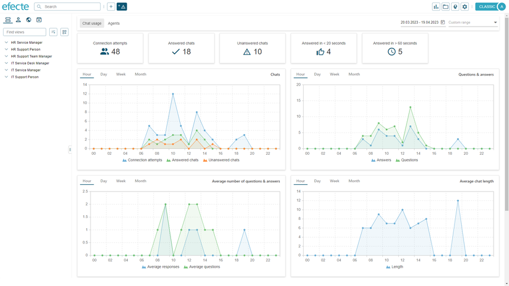
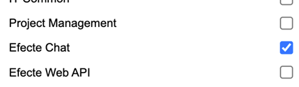
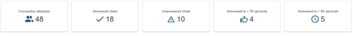
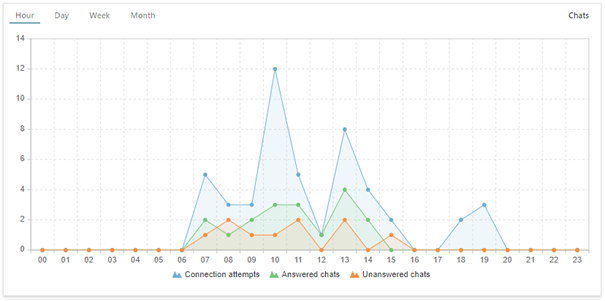
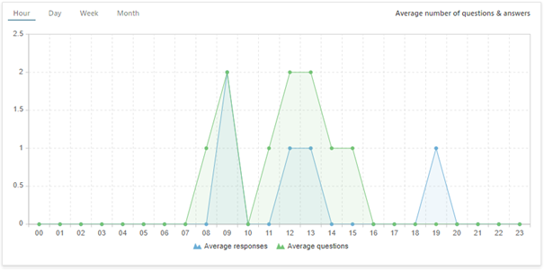
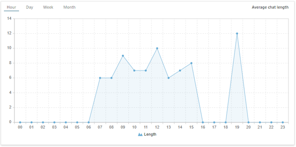
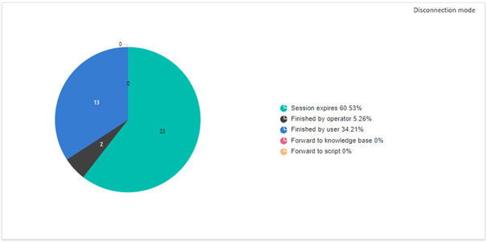
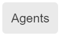
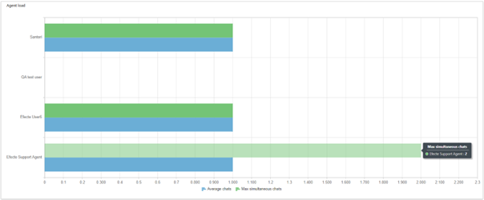

# New reporting capabilities for Efecte Chat

**Källa:** https://community.efecte.com/t/q6h41mn/new-reporting-capabilities-for-efecte-chat
**Publicerad:** 2023-05-26T11:56:21.513Z
**Uppdaterad:** 2023-05-27T20:23:29.870000
**Författare:** 

---

New reporting capabilities for Efecte Chat

      
    
          
      

        
              Luka WierzbickiEfecte Employee
            

            Product Manager for Conversational AI
              Luka_Wierzbicki
            updated 2 yrs agoSat, May 27, 2023 at 8:23 PM GMT+2
  

          3replies
        Juhamatti Tillonen2 yrs agoTue, May 30, 2023 at 7:52 AM GMT+2
  
        

        
    
ContentsDescription of functionalitySelection of periods TabsChatsQuestions & Answers Average number of questions & Answers Average chat length Disconnection mode Agent availability Agent Load Attention A new reporting module for Efecte Chat is now available, allowing service managers to view chat statistics and plan support capacity accurately.   
 The module requires a valid chat license in ESM (Efecte Service Management) and write permissions to Efecte Chat Module giving an option to show reporting for selected users only.   
 Users can select the date range for visualized data, with the option to choose from predefined values or freely from calendar views.   
 There are two tabs for separate statistics: Chat Usage and Agent Statistics showing metrics such as: connection attempts, answered chats, unanswered chats, number of answers/questions, average chat length, agent load, agent availability.   
   
 Features:   
 IEI-3664, IEI-3705 Chat Reports Icon in the header.   
 This icon [1] in the header is visible to users who have a valid Efecte Chat license and either admin or write permissions to the Efecte Chat module. By clicking on the icon, users can easily access Efecte Chat Reports and view statistics related to chat usage and agent performance.  
    
  
 IEI-4041 Reports groups into two separate tabs: Chat Usage, Agents.   
 The reporting module in Efecte Chat groups statistics into two separate tabs: Chat Usage and Agents. This allows us to access and analyze the relevant data and to make informed decisions about the support capacity planning.   
  
 IEI-3667 Fetch Data from InteliWISE platform.   
 With this feature, data is automatically fetched from the InteliWISE platform every time a user opens Efecte Chat Reports. This ensures that users have access to the most up-to-date information on chat usage and agent performance.   
  
Description of functionality 
Selection of periods  
    
 Select the period you are interested in or enter your own using the calendar.  
  
Tabs 
    
    
 Connection attempts: The number of times end users have tried to connect with agent.   
 Answered chats: The number of times an agent has answered users' questions in the chat.   
 Unanswered chats: The number of chats not made with the agent (connection attempt made when operators are not available or no response from the operator to the user's question).   
 Answered in < 20s: The number of chats made within 20 seconds of the time the user asked the question.   
 Answered in > 60s: The number of chats made 60 seconds after the user asked the question.   
  
Chats 
    
 The graph shows the relationship between connection attempts and conversations received and missed during a given time interval.   
  
Questions & Answers  
    
 The graph shows the total number of user questions and operator responses over a given time period from all conversations.   
  
Average number of questions & Answers  
    
 The graph shows the average number of user questions and operator responses per call in the selected time period.   
  
Average chat length  
    
 The graph shows the average duration of a conversation in each time interval.   
  
Disconnection mode  
    
 End types of chat conversations Live Chat:   
 Session expires - are conversations that have been ended by the end of session (value set by admin)   
 Finished by operator - are conversations that have been ended by the agent.   
 Finished by user - are conversations that have been ended by the user.   
 Forwarded to knowledge base - are end the Live Chat conversations and continues the conversations with the Virtual Agent.   
 Forwarded to script - ends the Live Chat conversations and redirects to the script.   
  
    
Agent availability  
    
 The graph shows information about the agent availability in relation to active chats. We can see the differences between availability, chatting and the amount of time agents were on break.   
  
Agent Load  
    
 The graph shows the average number of messages that the agent sends during one session and the maximum number of simultaneous conversations that the agent has in each period.   
  
Attention 
 
 Mobile devices are not supported  
 ESM version 2023.2 required 

          
  Like
  Follow
    
            2

## Bilder

