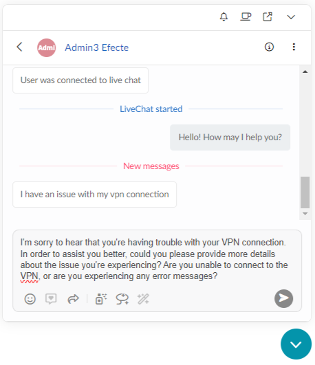
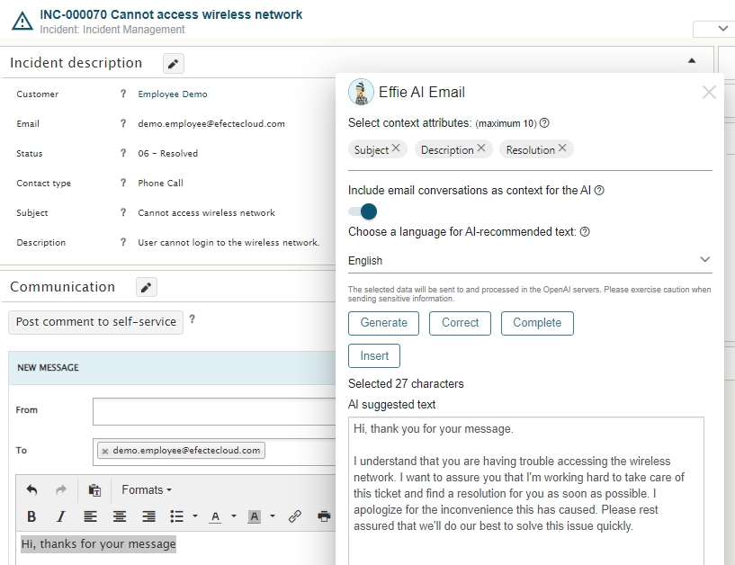
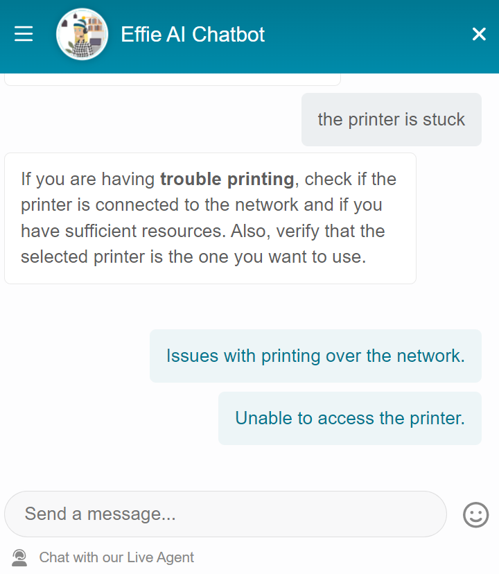

# Run Effie AI completely with Efecte-hosted AI models

**Källa:** https://community.efecte.com/t/35y3321/run-effie-ai-completely-with-efecte-hosted-ai-models
**Publicerad:** 2023-12-13T09:59:17.797Z
**Uppdaterad:** 2023-12-13T10:59:17.797000
**Författare:** 

---

Run Effie AI completely with Efecte-hosted AI models

      
    
          
      

        
              Juha HänninenProduct Owner
            

            ESM Product Owner
              Juha_Hanninen.1
            2 yrs agoWed, December 13, 2023 at 10:59 AM GMT+1
  

          

        
    
ContentsIntroducing Efecte GenAIFeatures using Generative AIEffie AI ChatEffie AI EmailFeatures using natural language processing and machine learningEffie AI ChatbotEffie AI TicketIntroducing Efecte GenAI
A few months ago, we launched Effie AI, the AI assistant helping end-users and agents on the Efecte platform. In 2023.4, we are bringing support for Effie AI's generative features to run on Efecte-hosted large language model with the technical preview of Efecte GenAI. This allows customers to run Effie AI entirely on a European-based cloud, with the Efecte GenAI being regionally hosted to serve multiple customers within a region.
Note that the Efecte GenAI will be first available as a technical preview, as it supports fully only English. The administrator can enable other languages for testing purposes, but they are not production-ready.
As a reminder, let's review each Effie AI feature and see how this affects the product.
Features using Generative AI
Effie AI has two features utilizing generative AI, where the new Efecte GenAI can be used: Effie AI Chat and Effie AI Email. These features also have OpenAI integration as an option for leveraging language models. 
Effie AI Chat
Effie AI Chat allows chat support agents to utilize generative AI to form customer responses in seconds. It is now possible to try Efecte GenAI as the language model generating the messages here.
The generative AI capabilities allow agents to quickly respond to user messages, reducing service times and allowing them to serve more customers.
The following buttons are available for agents in the UI: 
Generate - The agents can generate a new response from scratch Correct -  The agents can fix typing errors or produce a more precise response with the correct functionality. Complete - The agents can complete their sentences with the Complete feature. 

Effie AI Email
Effie AI Email allows agents to communicate with end users efficiently, with less manual effort. Effie AI email can be easily accessed in the email editor by clicking the Effie AI button at the bottom.
Effie AI Email currently has three key functionalities:

 Generate: This allows agents to create a new message from scratch. Agents can get ready-made, generated responses by providing contextual data such as ticket subject or description as selections before they request the message to be generated. Additionally, the agent can define the language they want to receive the answer from a list of supported languages.
 Correct: Agents can also use Effie AI Email for spell checking and correct any typing errors. First, they must select text in the email editor and then request the correction in the Effie AI Email window.
 Complete: Agents can finalize any incomplete message with the Complete feature. Like with the Correct feature, the agent must select the text they wish to complete.

The users can select up to 10 different context attributes to help generative AI to come up with a meaningful response. Additionally, the users can choose to include the existing email conversation as additional context, to make sure the generated answer is aware of conversation history and provides an answer fitting to the present moment.
The administrator can provide exact instructions for generating text with each of these, to make sure the responses are constructed in a manner that aligns with the company's communication policy.

 
Features using natural language processing and machine learning
Effie AI also leverages Natural Language Processing and machine learning to help users and agents with different tasks. Let's look at how Effie AI uses these technologies.
Effie AI Chatbot
Effie AI Chatbot is the always-on support for end users, available in the self-service portal or any site, understanding the users' issues using Natural Language Processing (NLP) technology. Effie AI Chatbot is trained to understand the most common problems your end users have to ensure that every user can get support fast. It does so by analyzing the user's message and providing a matching predefined, curated response so you will always know what responses users are getting.
Effie AI Chatbot can interpret user questions and provide valuable answers, guide users to additional resources, or help escalate the issues to support agents via live chat or tickets.

Effie AI Ticket
Formerly known as Virtual Coach, Effie AI Ticket enables service desk agents to find relevant content from the existing data, suggest classification, and reuse relevant content. 
Similar content provides ESM users with a list of items that Effie AI considers relevant for the open data card. Effie AI Ticket uses Natural Language Processing to find items in the Efecte platform that look similar to the open data card. This lets agents quickly find helpful information, such as previous root causes or resolutions.
Suggestions enable ESM users to classify data cards with, for example, category. Effie AI builds a statistical model from the existing data using machine learning to suggest the most likely values for fast classification.
Finally, users can easily fill repeating values from similar data cards with the copy functionality.
          
    
        Effie AI
      
    
  
  Like
  Follow
    
            2

## Bilder

