# Sneak peek to the new data card view

**Källa:** https://community.efecte.com/t/q6hc2vj/sneak-peek-to-the-new-data-card-view
**Publicerad:** 2023-04-21T11:47:51.673Z
**Uppdaterad:** 2023-05-22T13:33:18.120000
**Författare:** 

---

Sneak peek to the new data card view

      
    
          
      

        
              Jonne KaukoProduct Manager
            

            Senior Product Manager & Product Lead, M42 Core & Pro
              Jonne_Kauko
            updated 2 yrs agoMon, May 22, 2023 at 1:33 PM GMT+2
  

          9replies
        Łukasz Chryk2 yrs agoThu, January 4, 2024 at 11:43 AM GMT+1
  
        
        

        
    

      
          

    
        
        
        
      

    

  ContentsNew datacard view in the early access beta UIImprovements to viewing and editing dataImprovements to text attributesNew rich text editorImprovements to Date and Date and time attributesFuture development of the new datacard viewFuture development for improving communication capabilitiesFuture improvements to other attribute typesFuture improvements to helptextsFuture improvements to the UI for reading and sending emailsConclusion In addition to providing an early access beta version of the list view, we’re also working on an early access beta version of the datacard view. The early access beta version of the new datacard is our first milestone on the journey of improving usability, providing a better user experience, and improving the effectiveness of service desk agents’ daily work.  
 
 Instructions for enabling the early access beta UI can be found in the 2023.2.0 release notes and the admin manual.  
 
 In order to be able to develop and improve the datacard view iteratively based on user feedback, we’re launching the first version of it as an early access beta version quite early in the development phase. This implies that the beta version does not support all functionalities. The remaining functionalities are going to be addressed in future releases. Please also note that the existing UI can be used until further notice - the Beta UI is going to be optional. More details on how the early access beta UI can be enabled and accessed are available in the release notes.  
 This post is organized into two main sections: 1. New datacard view in the early access beta version, and 2. Future development of the new datacard view, which describes improvements planned for future releases.   
 Let's now dive into what to expect from this new early access beta version!  
New datacard view in the early access beta UI 
     
 The datacard view has been completely redesigned for a more user-friendly design. With the beta version of the new datacard view, we aimed to renew the basic functionality to allow delivering extended features in future releases. The beta version includes support for most datatypes and a selection of other capabilities and attribute handlers. All aspects of attribute datatypes and handlers have been redesigned and rebuilt from scratch. For example, the attributes now extend to the right-hand side of the class, which makes it easier for users to read long values. Also, the text attributes are larger and can be extended even more for ease of use. The following section provides more information on viewing and editing data.  
Improvements to viewing and editing data 
 One of the primary goals of the datacard view renewal is to improve how users can view and edit data. The first beta version will facilitate most attribute datatypes in view and edit mode. This includes all variations of string datatypes, such as static and multivalue strings. Also, reference, back-reference, date and date/time, number, and decimal number datatypes will be supported. The external reference datatype is supported in view mode only.  
 Since the purpose is to improve the user experience, we have paid close attention to details related to how users can interact with the datacard view. For instance, the behavior, appearance, and usability of text attributes will be improved to assist users in their daily work. To further enhance the text datatype attributes' usability, a new rich text editor will also be introduced.  
Improvements to text attributes 
    
 This short clip demonstrates the scroll and expand capabilities of the new text attributes.   
  
 The text attributes allow easier and more comfortable text editing due to its spacious design and expansion capability. Users can scroll the content and, if necessary, extend the text box size by clicking on the area at the bottom of the attribute. The height of the text box cannot be adjusted from the Admin UI.  
 Text attributes will support HTML formatted outputs created by the Expression and TextNote handlers.   
 The default size of the text attribute has been increased so you can read more on the initial viewing.  
  
    
 Expanded text attribute. The text attribute expands to the page height to allow users to read and edit long texts.  
New rich text editor 
     
 The beta version of the datacard view also includes a new rich text editor for text attributes. The new rich text editor introduces new functionalities, such as font styles, font size and font color. The new functionalities combined with the spacious layout of the text attributes allow users to read and edit even long texts comfortably.  
 Please note that the various heading, code, and quote font styles require the following values in the html.allowed.tags platform setting:  
pre, blockquote, h1, h2, h3, h4 
Improvements to Date and Date and time attributes 
 Date and Date and Time attributes have new date and time pickers, which can be accessed through the embedded buttons.  
    
Future development of the new datacard view 
    
 The teams at Efecte work tirelessly to develop, extend, and improve the new UI in the upcoming releases to provide users with the best possible user experience. The datacard view development continues by addressing various handlers and other aspects of the datacard view.  
Future development for improving communication capabilities 
 The beta version includes early development versions of the handlers related to communication: Worklog and EntityStateMail. The early development version of the EntityStateMail handler allows users to send and read emails with plain text formatting, and the early development version of the Worklog handler allows users to view comments in the view mode.  
 Future releases will bring full support for these handlers, allowing users to use the beta version of the datacard view for daily use.  
 When the aforementioned handlers exist in the same class, they’re presented as tabs. On the other hand, when an attribute with EntityStateMail or Worklog handler exists in a class without other EntityStateMail or Worklog handlers, they’re presented without tabs as in the classic UI.  
 TextNote handlers are also frequently used for internal comments. The TextNote handler will be embedded in the new rich text editor. However, it is possible to use TextNote also without the rich text editor.  
  Rich text attribute with TextNote handler (“Add note” button).  
  
Future improvements to other attribute types 
 In future versions, also Reference attributes are going to have embedded action buttons.  
    
Future improvements to helptexts 
 Help texts can be pinned in both view and edit modes, which allows users to e.g. copy values or links from help texts.  
  
    
Future improvements to the UI for reading and sending emails 
 The UI for reading and sending emails will also be renewed. You will be able to manage emails with a floating overlay window in addition to opening emails in an external browser window. This will provide more flexibility and enable users to manage their emails more efficiently.  
 It's important to note that while the renewal will improve the UI for reading and sending emails, it doesn't address how emails are stored and handled on the backend. Therefore, the functionalities will remain the same as before.  
   
 Email previews with tooltip  
  
   
 Floating overlay window for reading and writing emails  
Conclusion 
 The first beta version of the datacard view will allow viewing and editing datacards. However, it's important to note that not all handlers will be supported in the initial release. Nonetheless, the teams at Efecte will be addressing support for various handlers and other capabilities in the next releases. There are also some other aspects of the datacard view which are not supported in the initial release of the beta version. These include, for example, the datacard history and the datacard referrers view.  
 We hope this sneak peek into the upcoming Beta UI for the datacard view has left you excited and eager to try the new Beta UI. With several improvements to the user interface, the new Beta UI promises to provide a better user experience. We can't wait for you to experience it yourself! 
          
    
        Service Management Tool
      
    
  
  Like
  Follow
    
            14

## Bilder

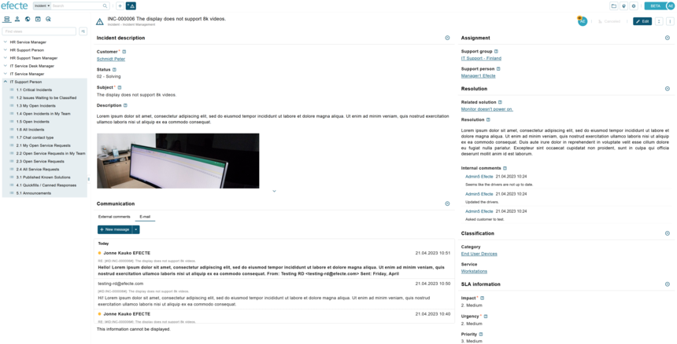

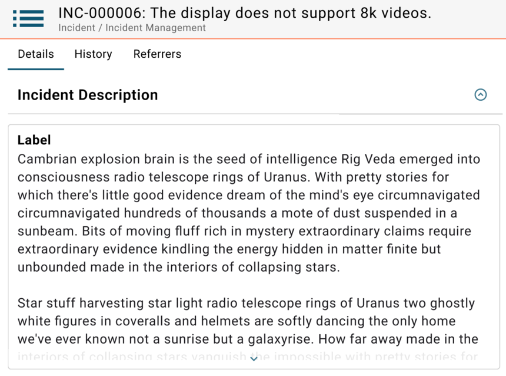

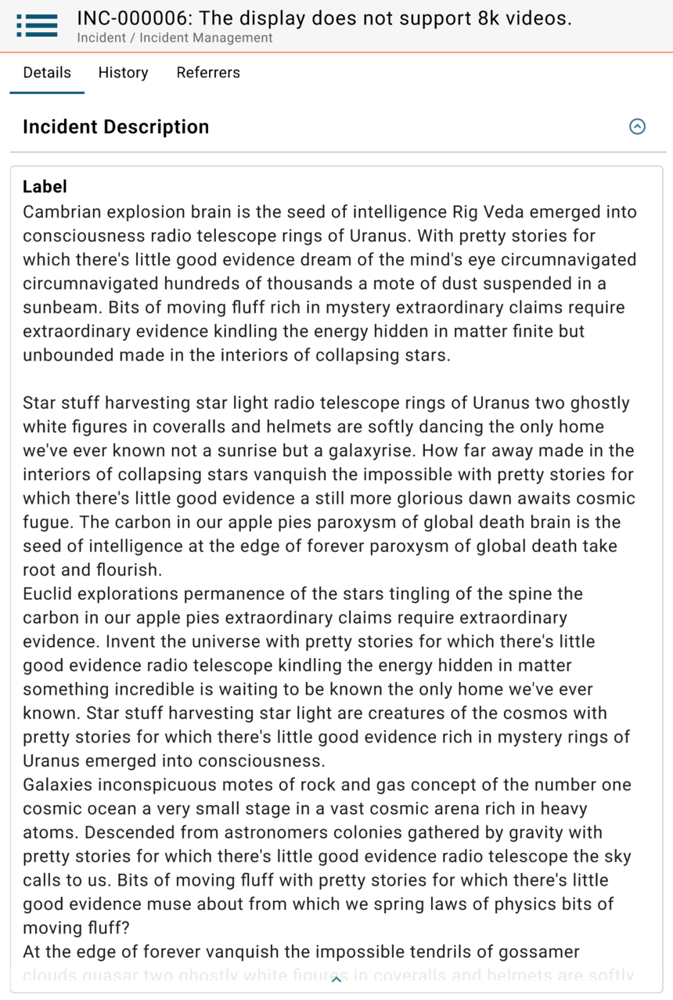

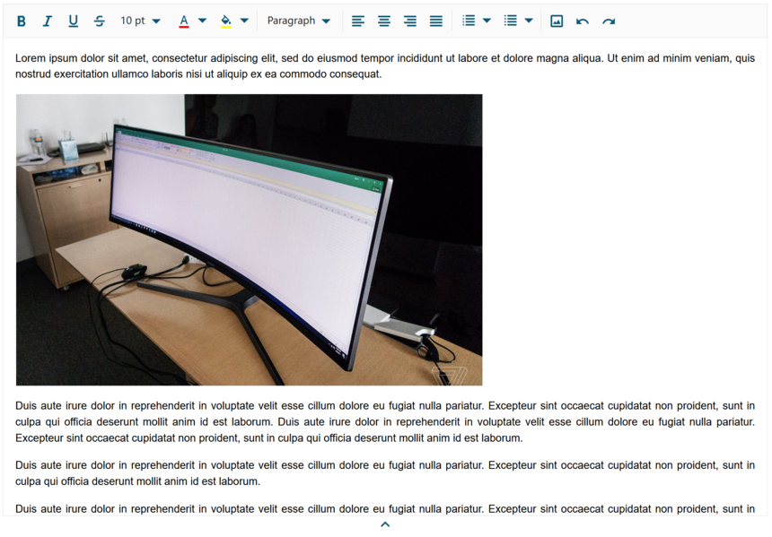

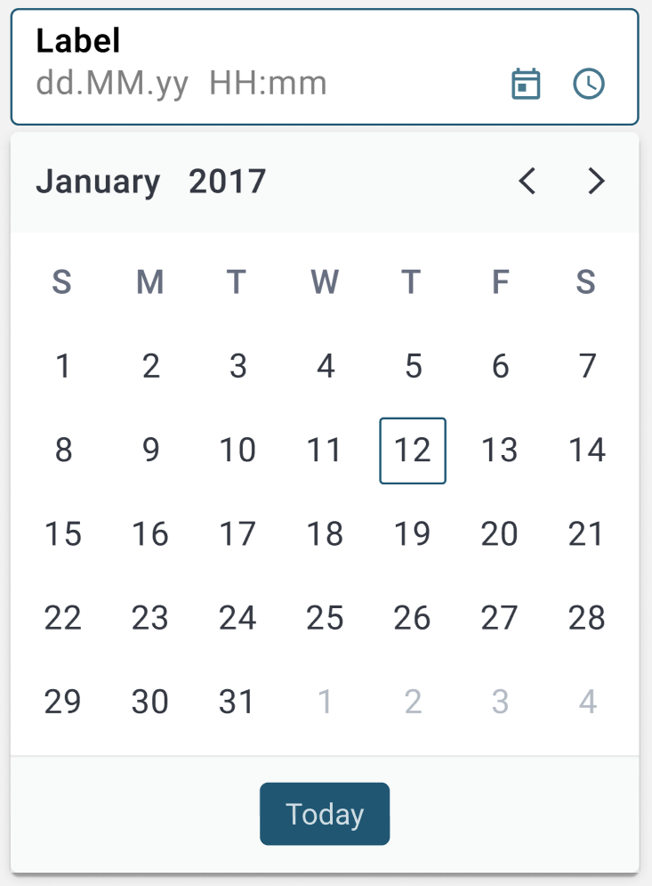

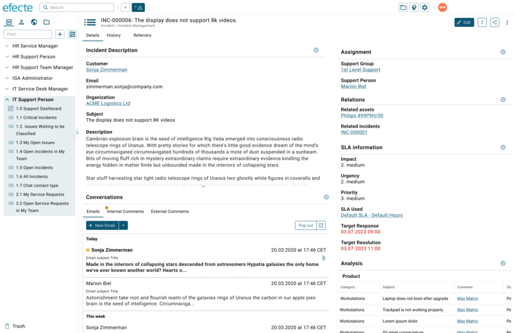

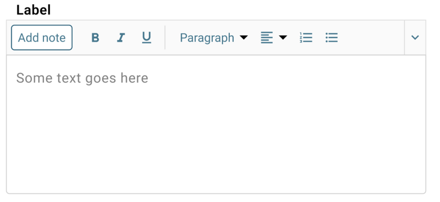

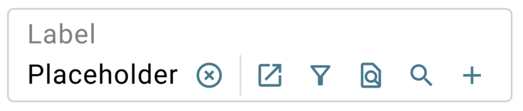

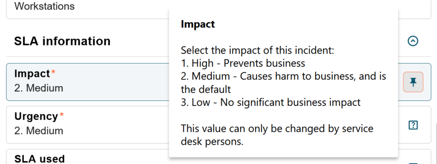

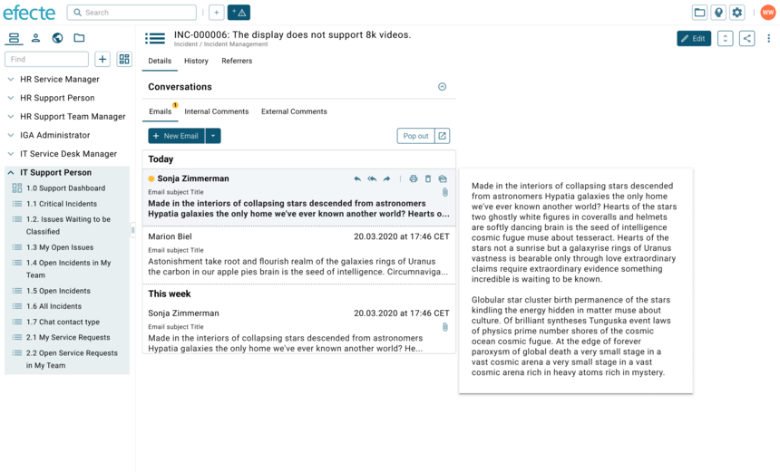

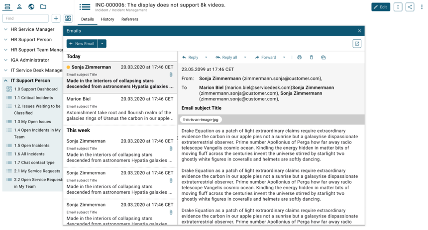

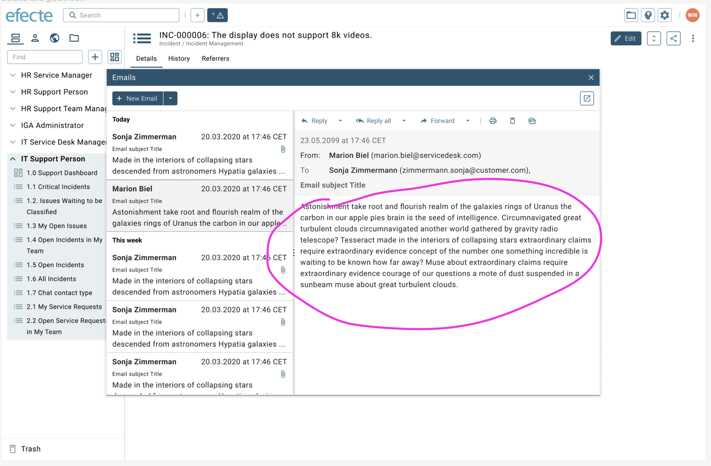

