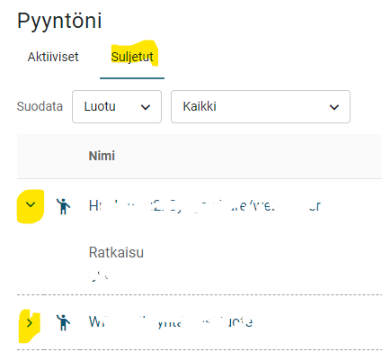

# ESS2: My cases and additional information from the ticket

**Källa:** https://community.efecte.com/t/q6ykgnz/ess2-my-cases-and-additional-information-from-the-ticket
**Publicerad:** 2025-06-18T11:52:19.730Z
**Uppdaterad:** 2025-06-18T13:52:19.730000
**Författare:** 

---

ESS2: My cases and additional information from the ticket

      
    
          
      

        
              Teemu Keski-Simonen
            

            
              Teemu_KeskiSimonen
            7 mths agoWed, June 18, 2025 at 1:52 PM GMT+2
  

          1reply
        Aki YlivarviModerator2 mths agoMon, November 3, 2025 at 9:22 AM GMT+1
  
        

        
    
We would like the ability to view additional ticket details without opening the ticket in the "My Cases" view. Currently, for open tickets, there is no way to see the ticket content without clicking to open it, and for closed tickets, only the resolution is visible.
We hope the feature would work so that the administrator can define which fields are displayed when additional ticket details are expanded using the arrow.

          
    
        ESS2
      
    
  
  Vote
  Follow
    
            4

## Bilder

