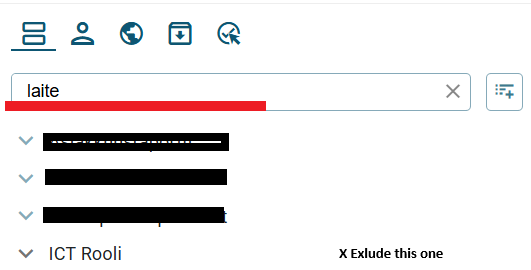

# How to exclude views from Search -user interface edit.

**Källa:** https://community.efecte.com/t/g9y1lk9/how-to-exclude-views-from-search-user-interface-edit
**Publicerad:** 2025-09-08T11:45:42.270Z
**Uppdaterad:** 2025-09-08T13:45:42.270000
**Författare:** 

---

How to exclude views from Search -user interface edit.

      
    
          
      

        
              Juho Romppanen
            

            
              Juho_Romppanen
            4 mths agoMon, September 8, 2025 at 1:45 PM GMT+2
  

          1reply
        Juha HänninenProduct Owner2 mths agoMon, November 3, 2025 at 8:21 AM GMT+1
  
        

        
    
"Search from views" is handy. Our problem is that ESM has been in use for quite some time, and there are multiple similar views that are almost identical but needed for different points of view.
Could you add a button to exclude some views from this "search of views" column?
(For example, the line that includes "laite", meaning device.)
The exclude button would be custom for the current user and saved to the user's custom preferences.

          
    
        IT Service Management
      
    
  
  Vote
  Follow

## Bilder

