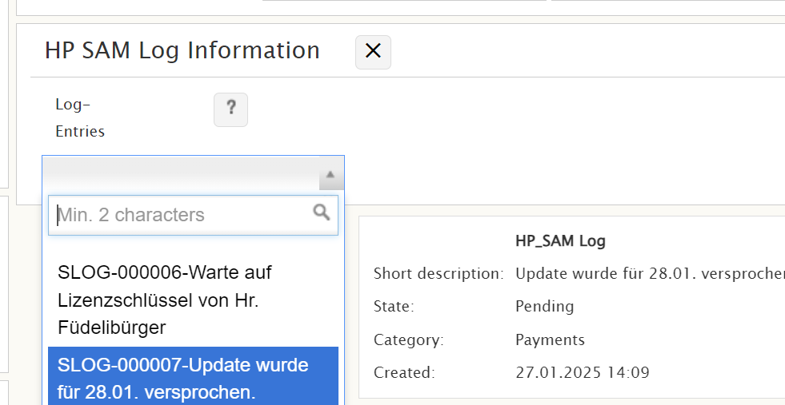
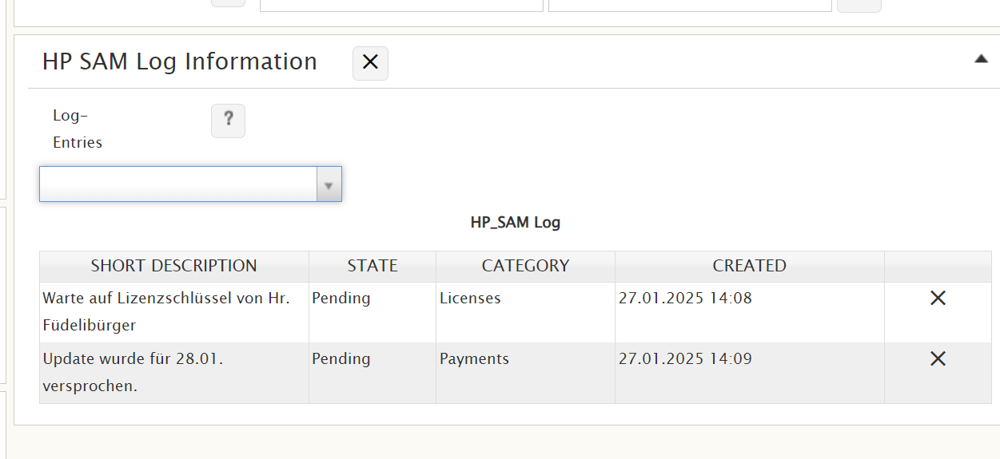

# Automatically select all filter results in a dropdown to show them in the "Show selected values of referred template" list

**Källa:** https://community.efecte.com/t/83yl5hf/automatically-select-all-filter-results-in-a-dropdown-to-show-them-in-the-show-selected-values-of-referred-template-list
**Publicerad:** 2025-01-27T14:12:23.183Z
**Uppdaterad:** 2025-01-27T15:12:23.183000
**Författare:** 

---

Automatically select all filter results in a dropdown to show them in the "Show selected values of referred template" list

      
    
          
      

        
              Oliver Burtscher
            

            
              Oliver_Burtscher
            11 mths agoMon, January 27, 2025 at 3:12 PM GMT+1
  

          4replies
        Antti AholaEfecte Employee8 mths agoMon, April 28, 2025 at 3:12 PM GMT+2
  
        

        
    
Hi everybody
We have a dropdown that shows values from another template based on the filter set in the custom attributes. This works fine. But the goal is it to list all available entries in that dropdown in the "Show selected values of referred template" - list automatically after a re-save (which is also done automatically from time to time).
Here's an example:
Current situation:

These 2 results in the dropdown (based on a filter) should automatically be selected after a re-save, so this result is reached:

The main goal is that everytime a user opens this datacard, the related log entries available are shown without the need to first select them in the dropdown.
Probably this could be done with an expression that selects all available entries in the dropdown (which is based on a filter). But - how?
THANKS!
Oli
          
  Like
  Follow

## Bilder

