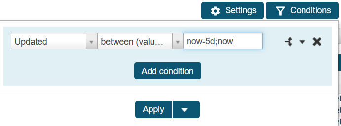
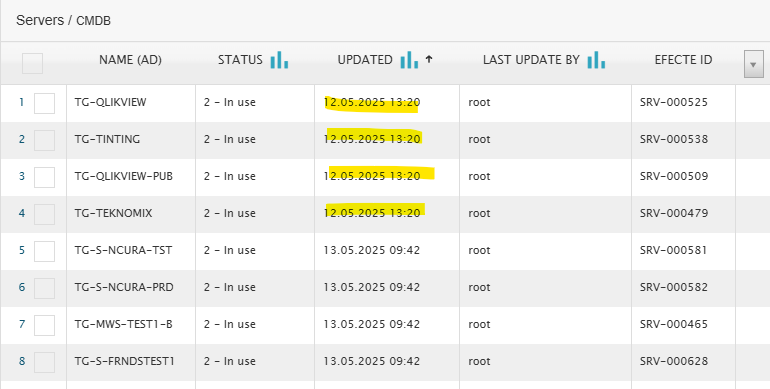
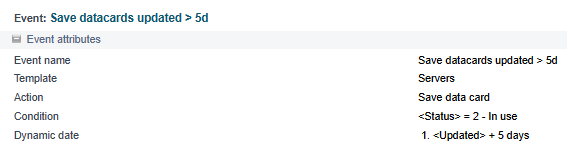
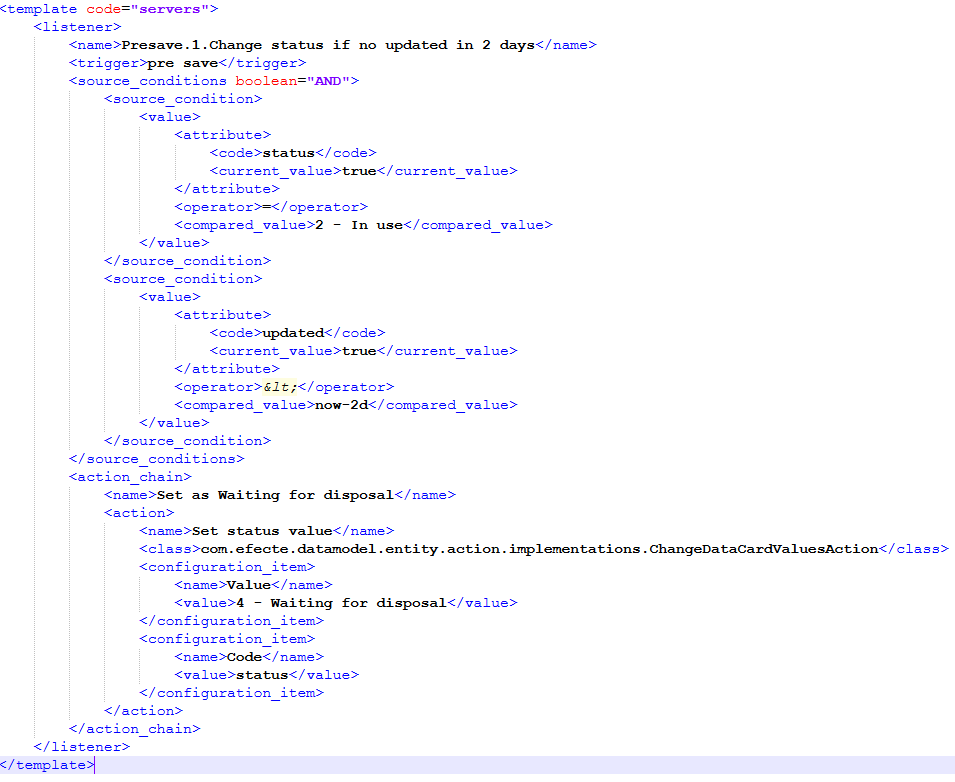
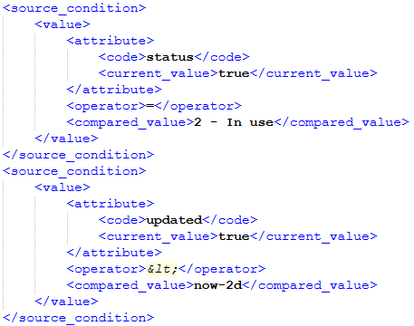

# Change status based on Updated attribute

**Källa:** https://community.efecte.com/t/h7yk3zy/change-status-based-on-updated-attribute
**Publicerad:** 2025-05-13T12:10:06.670Z
**Uppdaterad:** 2025-05-13T14:10:06.670000
**Författare:** 

---

Change status based on Updated attribute

      
    
          
      

        
              Luis Martínez
            

            
              Luis_Martinez
            8 mths agoTue, May 13, 2025 at 2:10 PM GMT+2
  

          10replies
        Luis Martínez2 mths agoWed, November 5, 2025 at 12:37 PM GMT+1
  
        

        
    
Hi,
I would like to change the status of those datacards in a template that have not been updated for the last 5 days. 
Can you give me some ideas on how to implement that?
Thanks in advance.
          
  Like
  Follow

## Bilder

