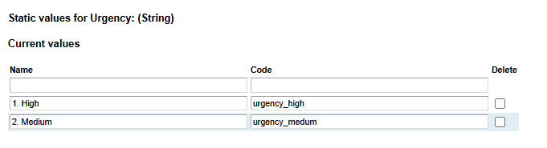

# How to add static values

**Källa:** https://community.efecte.com/t/83yla8z/how-to-add-static-values
**Publicerad:** 2025-02-16T06:14:12.597Z
**Uppdaterad:** 2025-02-16T07:14:12.597000
**Författare:** 

---

How to add static values

      
    
          
      

        
              Luis Martínez
            

            
              Luis_Martinez
            11 mths agoSun, February 16, 2025 at 7:14 AM GMT+1
  

          2replies
        Luis Martínez11 mths agoWed, February 19, 2025 at 12:43 PM GMT+1
  
         Answered
        

        
    
HI,
Does anyone know how to add static values to an attribute?
I'm able to delete them and change their values but I don't find the option to add new ones.

Thanks in advance,
Luis
          
    
        Templates
      
    
  
  Like
  Follow

## Bilder

