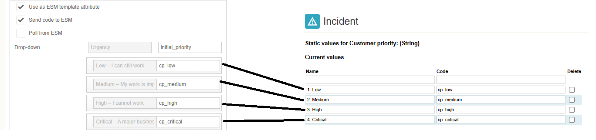
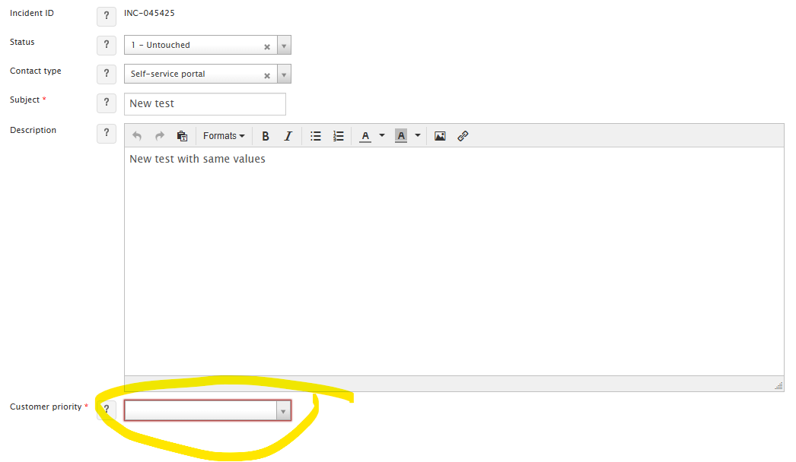

# Mapping dropdown values from ESS to ESM

**Källa:** https://community.efecte.com/t/g9ylam8/mapping-dropdown-values-from-ess-to-esm
**Publicerad:** 2025-02-16T18:35:02.657Z
**Uppdaterad:** 2025-02-16T19:35:02.657000
**Författare:** 

---

Mapping dropdown values from ESS to ESM

      
    
          
      

        
              Luis Martínez
            

            
              Luis_Martinez
            11 mths agoSun, February 16, 2025 at 7:35 PM GMT+1
  

          1reply
        Marko LehtoEfecte Employee10 mths agoFri, February 21, 2025 at 9:05 AM GMT+1
  
        

        
    
Hi,
I'm trying to map the values of a dropdown selection from the ESS to an attribute with static values in ESM but those are not being passed/mapped.
Any idea what I'm doing wrong?

 
Thanks
Luis
          
  Like
  Follow

## Bilder

