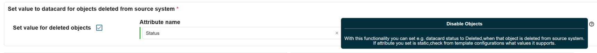

# new "deletion fact" support in EPE connectors: how does it work exactly?

**Källa:** https://community.efecte.com/t/p8yphlp/new-deletion-fact-support-in-epe-connectors-how-does-it-work-exactly
**Publicerad:** 2025-11-24T09:45:29.783Z
**Uppdaterad:** 2025-11-24T10:45:29.783000
**Författare:** 

---

new "deletion fact" support in EPE connectors: how does it work exactly?

      
    
          
      

        
              Peter Scheffczyk
            

            Advisory Solution Consultant
              Peter_Scheffczyk.1
            1 mth agoMon, November 24, 2025 at 10:45 AM GMT+1
  

          2replies
        Peter Scheffczyk1 mth agoTue, November 25, 2025 at 11:57 AM GMT+1
  
         Answered
        

        
    
Anyone already gained some experience with the new "deletion fact" settings in the EPE connectors? 

 Do these work with "full" fetch type only, or also with "incremental"? And what does "deleted from source system" means technically? Does EPE maintain a cached list of objects imported in each run and applies this new setting to each object missing in the import "compared to the last run"? What happens if the object is included in the next run again? Is the setting then "undone"?
Docs does not have a detailed description on this setting (yet) and also the entry in the Release Notes is very short.
          
  Like
  Follow

## Bilder

