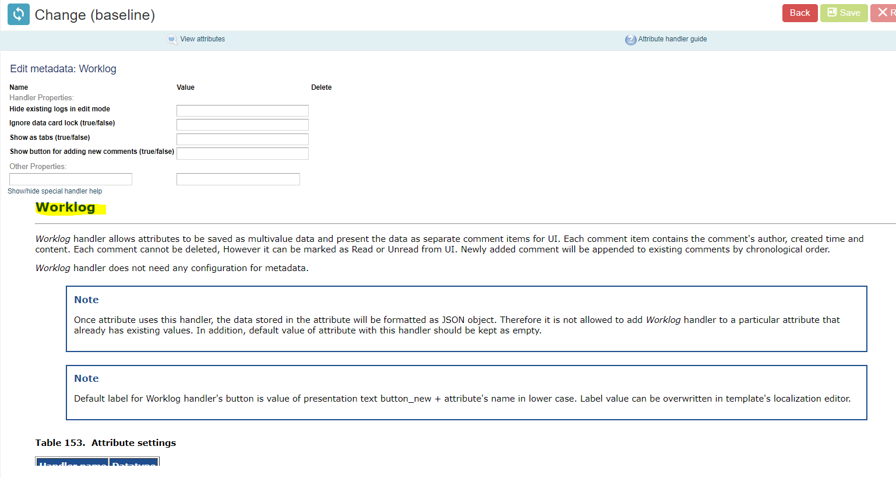
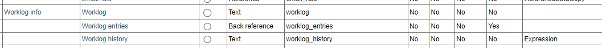
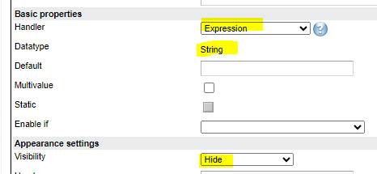
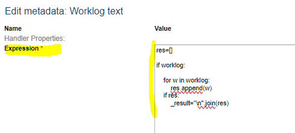

# Worklog entries in View

**Källa:** https://community.efecte.com/t/x2y651r/worklog-entries-in-view
**Publicerad:** 2024-04-25T12:00:47.383Z
**Uppdaterad:** 2024-04-25T14:00:47.383000
**Författare:** 

---

Worklog entries in View

      
    
          
      

        
              Riina Oikarinen
            

            
              Riina_Oikarinen
            1 yr agoThu, April 25, 2024 at 2:00 PM GMT+2
  

          5replies
        Tommi Ekholm1 yr agoWed, November 6, 2024 at 7:34 AM GMT+1
  
         Answered
        

        
    

Is it so that Worklog entries cannot be seen in the view and therefore not able to export into Excel?  
It seems that we do have alternative another solution with 3 attributes and expression. However, the worklog handler would have been more modern feel like in UI

 

 

          
  Like
  Follow
    
            1

## Bilder

