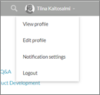
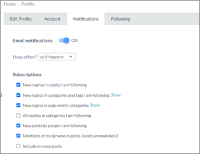
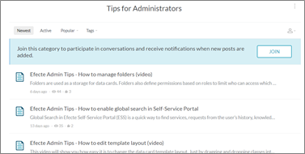
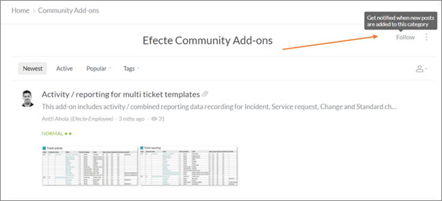

# Efecte Admin Tips – Community notifications

**Källa:** https://community.efecte.com/t/g9hlgwb/efecte-admin-tips-community-notifications
**Publicerad:** 2021-03-22T09:25:41.003Z
**Uppdaterad:** 2025-12-10T11:37:40.533000
**Författare:** 

---

Efecte Admin Tips – Community notifications

      
    

        updated 1 mth agoWed, December 10, 2025 at 11:37 AM GMT+1
  
          

        
    
Are you up to date on the new things on Community? Do you want to get notifications from new Admin Tips?  Have you noticed that you could get notifications about new topics or your followings? If not, please go to your profile from the top right corner and adjust the notifications according to your preferences. 
Notifications settings

If you like to get notifications from new Admin tips, go to Tips for Administrators section and click JOIN. 

If you want to follow a certain Community category, click on Follow on the top right corner. 

Thanks for reading, and as always, don't hesitate to contact us in case you have any questions!
- Team Efecte
Don’t have admin training or looking for a refresh? View upcoming dates and enroll to one of our public trainings here or send us email.
..Psst, don’t forget, we also offer tailored trainings, contact your account manager for more information.
          
  Like
  Follow
    
            1

## Bilder

