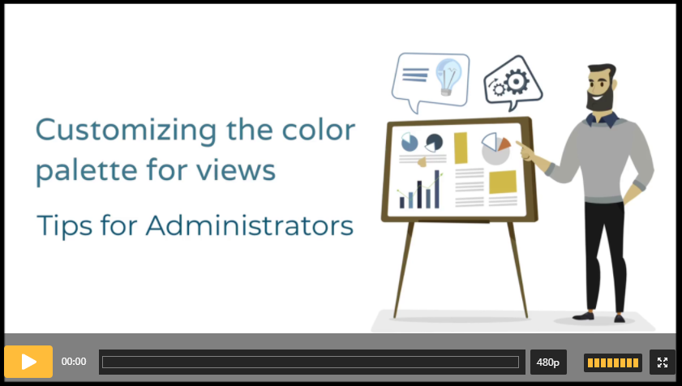

# Efecte Admin Tips: Customizing the color palette for views (video)

**Källa:** https://community.efecte.com/t/60hp9qh/efecte-admin-tips-customizing-the-color-palette-for-views-video
**Publicerad:** 2021-10-25T06:35:30.603Z
**Uppdaterad:** 2025-12-10T11:16:35.243000
**Författare:** 

---

Efecte Admin Tips: Customizing the color palette for views (video)

      
    

        updated 1 mth agoWed, December 10, 2025 at 11:16 AM GMT+1
  
          2replies
        Tiina Kaitosalmi4 yrs agoWed, December 22, 2021 at 1:19 PM GMT+1
  
        

        
    
Did you know that color order in graph, and calendar views can be changed by dragging and dropping colors in a specific order by any user? And did you know that you as an administrator can provide users specific color palettes, for example brand colors of your own organization, to use in their views?
If you want to learn more, watch this week’s video.
 Length: 2:11
Thanks for watching, and as always, don’t hesitate to contact us in case you have any questions!
-          Team Efecte
Haven’t attended admin training yet or looking for a refresh? View upcoming dates and enroll to one of our public trainings here or send us email.
..Psst, don’t forget, we also offer tailored trainings. Contact your account manager for more information.
          
    
        Service Management Tool
      
    
        Administration
      
    
        Video
      
    
  
  Like
  Follow
    
            4

## Bilder

