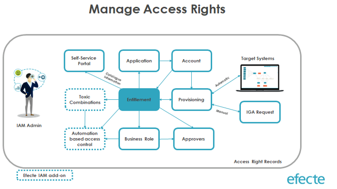

# Efecte Admin Tips – Efecte IGA - Manage Access Rights via Entitlements

**Källa:** https://community.efecte.com/t/p8hmff0/efecte-admin-tips-efecte-iga-manage-access-rights-via-entitlements
**Publicerad:** 2020-11-10T09:43:56.470Z
**Uppdaterad:** 2025-12-10T11:41:55.673000
**Författare:** 

---

Efecte Admin Tips – Efecte IGA - Manage Access Rights via Entitlements

      
    

        updated 1 mth agoWed, December 10, 2025 at 11:41 AM GMT+1
  
          

        
    
Efecte IGA (=Identity Governance and Administration) makes adding access rights simple. From the Self-Service Portal, managers can easily add access rights for several users including subordinates, project members or any internal or external employee in the system.
Requesting new access rights can be divided into different categories:

 Individuals, order new access rights for themselves
 Managers, request access rights for subordinates
 HR personnel, request access rights for any user
 Any other specific user group your organization may have (for example external-user management)

The Efecte IGA solution allows organizations to manage any access rights through advanced administration, simplified auditing and continuous real-time monitoring of entitlements. Access rights management is easy with Efecte IGA via the Entitlement template, which contains information about access rights into a specific system, application or resource.
Please follow these steps in order to set up a new entitlement / group to be ordered in the Self-Service Portal.
Create new Entitlement (for manual provisioning)
1. In Efecte IGA, create a new Entitlement data card 2. Fill in the needed information         a. User-friendly name         b. Description         c. Categorization for order catalogue         d. Etc. 3. Select provisioning type = Manual (this is mandatory for non-directory-based entitlements) 4. Select related Application 5. Entitlement will be available in the Self-Service Portal for ordering after MyServices are updated (this might vary depending on the customer environment configuration)
 
Create new Entitlement (for automatic provisioning)
1. As an assumption, group information is automatically read from the source system         a. This will automatically create an entitlement data card in Efecte IGA 2. Add more information to the group / entitlement data card         a. User-friendly name         b. Description         c. Categorization for order catalogue         d. Etc. 3. Select provisioning type = Automatic (this is mandatory information for directory-based entitlements) 4. Select related Application 5. Entitlement will be available in the Self-Service Portal for ordering after MyServices are updated (this might vary depending on the customer environment configuration)
 
Management of Entitlement
1. Add new entitlements into     a. Business role     b. Automated access control (ABAC / RBAC)     c. Create Toxic Combinations

Thanks for reading, and as always, don't hesitate to contact us in case you have any questions!
 
- Team Efecte
 
Don’t have admin training or looking for a refresh? View upcoming dates and enroll to one of our public trainings here or send us email.
..Psst, don’t forget, we also offer tailored trainings, contact your account manager for more information.
          
    
        IGA
      
    
  
  Like
  Follow

## Bilder

