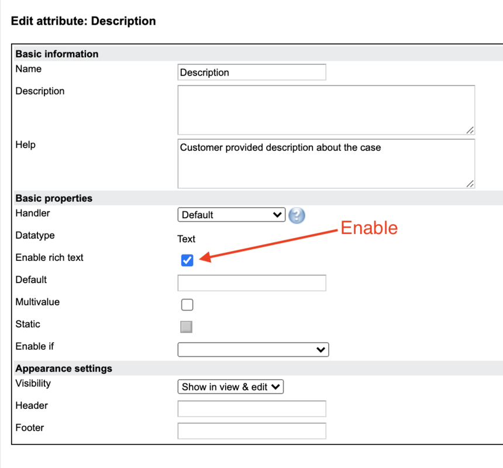

# Efecte Admin Tips - Enable Text Formatting and Image Embedding

**Källa:** https://community.efecte.com/t/q6h80cf/efecte-admin-tips-enable-text-formatting-and-image-embedding
**Publicerad:** 2020-09-01T10:29:37.993Z
**Uppdaterad:** 2025-12-10T11:47:07.063000
**Författare:** 

---

Efecte Admin Tips - Enable Text Formatting and Image Embedding

      
    

        updated 1 mth agoWed, December 10, 2025 at 11:47 AM GMT+1
  
          5replies
        Jan-Peter MalmbergEfecte Employee5 yrs agoFri, November 6, 2020 at 8:31 AM GMT+1
  
        

        
    

      
          

    
        
        
        
      

    

  This week we have a simple quick tip for you. Did you know you can highlight or make text bold in Efecte? Or embed an image between text, say to a KB-article? It might not be enabled in your configuration by default, but that's easily changed!
Head to Template administration and with any Text-datatype attribute, set "Enable rich text" checked and you're done. Now, next time you have a data card in edit, you'll see the text formatting ribbon above the field.

Simple, right?
 
- Team Efecte
 
P.s. the feature is available in the modern Efecte version. If you're with the Efecte cloud platform, the environment has received the feature through Efecte's automated cloud system upgrade without additional costs. Besides the rich text feature also enables html formatted emails to include embedded images and text formatting.
 
Don't have admin training or looking for a refresh? View upcoming dates and enroll to one of our public trainings here or send us email.
...Psst, don't forget, we also offer tailored trainings, contact your account manager for more information.
          
    
        Administration
      
    
  
  Like
  Follow
    
            3

## Bilder

