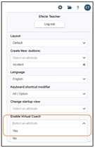
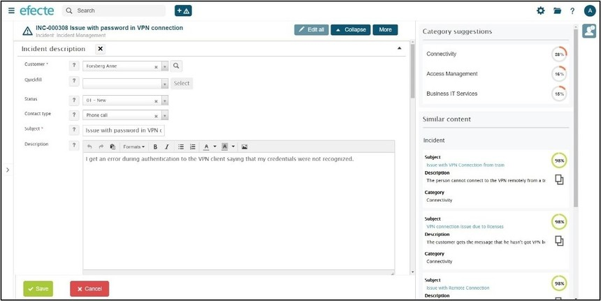
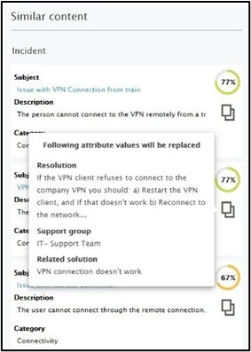

# Efecte Admin Tips: Have you already heard about ViCo (Virtual Coach)

**Källa:** https://community.efecte.com/t/x2hgh45/efecte-admin-tips-have-you-already-heard-about-vico-virtual-coach
**Publicerad:** 2021-10-11T06:09:33.893Z
**Uppdaterad:** 2025-12-10T11:17:35.210000
**Författare:** 

---

Efecte Admin Tips: Have you already heard about ViCo (Virtual Coach)

      
    

        updated 1 mth agoWed, December 10, 2025 at 11:17 AM GMT+1
  
          

        
    
What is it? ViCo will help users to find similar issues or solutions when handling different data. It will help users to work more efficiently and with better quality.  ViCo will help users to fill in data correctly, which will help also the training of the new users.  You get the most out of ViCo when you have been using Efecte for a longer time and have at least 5000 data cards of each template you want to use Virtual Coach with.
How to get it? Virtual Coach is a licensable feature, and a valid license needs to be in place in order to use ViCo features. Please contact your Sales Representative.
Virtual Coach features Similarities: Lists similar items from the system based on configurable template attributes. Efecte administrator can for example configure that ViCo will list similar Incidents based on the subject and description attributes on the template.
References: Enables users to fill a configured field on a data card with a value suggested by ViCo, based on existing data. References make it faster and easier to select the right category, support group or other classifiable attribute when working on a data card.
Quick Aid: Feature for end users allowing them to quickly fill data cards with values suggested by ViCo (in edit mode).
How to use it? When ViCo is enabled and configured, the users can enable the ViCo for themselves from the user profile (Enable Virtual Coach).

When you are handling the data card where ViCo is configured, you can click   icon to get category suggestions and similar content.
 Quick aid will allow you quickly fill data cards with values suggested by ViCo. By pressing  icon, values are filled in.
    Note:  All results provided by Virtual Coach depends on the quality and amount of data.
How to configure it? When a license is in place, ViCo needs to be configured to those templates, where it is wanted to help the users. A maximum of 5 templates can be defined. ViCo will be accessible in the user interface only when working on these configured data cards. You can find configuration instructions here.
More details also in the latest Service Management Tool Admin Manual, which can be found here.
Thanks for reading, and as always, don't hesitate to contact us in case you have any questions!
- Team Efecte
Haven't attended admin training yet or looking for a refresh? View upcoming dates and enroll to one of our public trainings here or send us email.
..Psst, don’t forget, we also offer tailored trainings, contact your account manager for more information.
          
    
        Service Management Tool
      
    
        Administration
      
    
  
  Like
  Follow
    
            2

## Bilder

