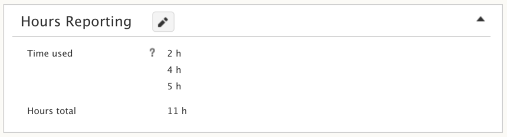
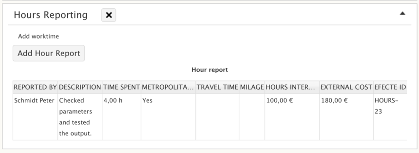
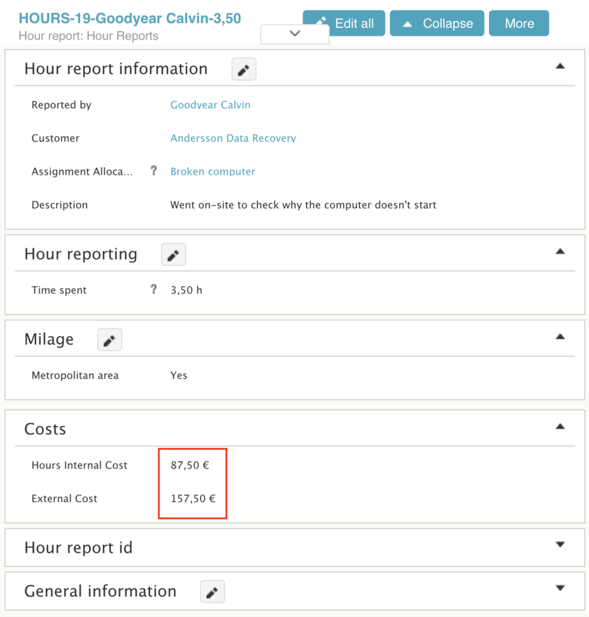

# Efecte Admin Tips - Hours Reporting

**Källa:** https://community.efecte.com/t/q6h6k23/efecte-admin-tips-hours-reporting
**Publicerad:** 2020-09-29T07:49:01.917Z
**Uppdaterad:** 2025-12-10T11:44:25.970000
**Författare:** 

---

Efecte Admin Tips - Hours Reporting

      
    

        updated 1 mth agoWed, December 10, 2025 at 11:44 AM GMT+1
  
          

        
    
How much time have I spent in total solving tickets like Incident or a Service Request can be vague. Automated reporting is usually enough for most and things like automated status change tracking gives us a really good starting point and a lot of good data. Though sometimes, we might want to dive deeper and log in the hours in more detail. One reason might be that multiple persons can be involved in various roles. Another reason, which might be more obvious for e.g. service providers, is invoicing.
There are several ways of how your hours reporting can be built into Efecte, starting from a simple input field on a template to more complex, integrated and automated processing. On a scale from 0 to 10 where 0 being only automated reporting in place and 10 being the most complex setup, this posting will focus on examples on levels 2 and 8
 
Different levels of hours reporting  
Levels 0 to 1
On level 0 there is no manual records of hours, only automatically created time stamps and automatically calculated data. Good for many things, but not hours reporting per se. Level 1 hours reporting gets you going with a simple input on a template - nothing special to explain there. You add a new attribute on to a template where the user can fill in “Time spent” and you’re good to go. Overly simplified for many, but good enough for tracking actual time spent in small environments.
Level 2
To make things a bit more flexible, on level 2 we make a re-usable, easy to fill hours reporting for smaller teams, like the end-result shown below:
 The setup
Let’s go to the Incident template and create a new class called “Hours reporting”. We’re adding it on to Incident template, but by creating a dedicated class, it’s easy to deploy on to other templates too (go to another template and hit “Select classes” from the top row).
Let’s then add two attributes to this class: the first one is called “Time used” and it’s a number (or a decimal) type, set as multi-value. This enables users to log multiple inputs more easily. The next attribute is “Hours total”, a field that automatically sums up the input hours. Obviously, the type is also a number (or decimal), but we'll also add an Expression handler to it. Don’t worry, you don’t need to know Python for this, we’ll include an example below.
Above you saw how the end result looks like. Several hours logged in with a single field and right below the inputs is the automatically calculated sum. 
The expression can be built in various ways, here’s an example to get you going. For the sake of clarity, it’s written for easy readability. In the “Hours total” attribute, make sure the Expression handler is selected on to the handler field. Then click “Attribute metadata” and feed the short script below to a field where it says “Expression”:
_sum = 0 _result = 0 _add = 0
_data = this.getAll("time_used") if _data != None:   for i in _data:    _add = i    if _add != None:      _sum = _sum + _add _result = _sum
Also make sure, the attribute visibility is set to “View only” as it’s always overwritten by the expression so people don’t waste time trying to do the math themselves ;)
And for readability, you may want to fill in “h” to the Footer.
Levels 3 to 7
Depending on needs, there are many minor steps to take in between levels 3 to 7, so let’s skip these and jump right ahead on to level 8.  
Level 8
Level eight is not about how complex you can make the configuration, but what to expect from more comprehensive hours reporting.
When you need detailed reporting or the data to be carried out of the system into an external system like billing, some additional steps might be needed.
First, the level 2 configurations basic idea is still valid, use a separate class for inputs to easily duplicate the setup throughout the configuration.
Next, have a separate template called “Hours reporting”. Instead of directly inputting the hours on the target template, we’ll switch to using a dedicated template for it that can be embedded to the process template, like Incident. Here’s how the end result might look like:
 The building blocks to make this happen consist of

 Target template (usually a process template like Incident or Service Request)
 Dedicated "Hour report" -template
 Transformation-tool (defined on to a target template towards "Hour report" -template)
 Hours reporting class with "Add work time" -reference attribute and optionally combined with auto-calculated sum (as we had in the level 2 example)

The Hour report template can include, besides hours, also travel time & costs, work type (role) and basically whatever else is needed. For instance, have additional costs calculation included when you need the data for invoicing.
 As for the configurations, you have a concept here, but the details go by the environment and therefore not all the bits and pieces are included. You can go even beyond the example and target level 10, but from this point onwards, the needs are so customer specific that we’ll stop here.
So, there it is, hours reporting in Efecte in a nutshell. If you plan to implement hours reporting, don’t hesitate to turn to our helpful consultants for anything you might need assistance in with the configuration.  
Thanks for reading! Until next time.
 
- Team Efecte
 
Don't have admin training or looking for a refresh? View upcoming dates and enroll to one of our public trainings here or send us email.
...Psst, don't forget, we also offer tailored trainings, contact your account manager for more information.
          
    
        Administration
      
    
  
  Like
  Follow
    
            2

## Bilder

