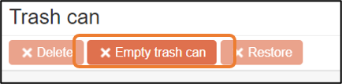
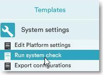

# Efecte Admin Tips - How (and why) to empty the trash can

**Källa:** https://community.efecte.com/t/y4hfgfg/efecte-admin-tips-how-and-why-to-empty-the-trash-can
**Publicerad:** 2021-05-10T11:41:29.323Z
**Uppdaterad:** 2025-12-10T11:13:08.390000
**Författare:** 

---

Efecte Admin Tips - How (and why) to empty the trash can

      
    

        updated 1 mth agoWed, December 10, 2025 at 11:13 AM GMT+1
  
          3replies
        Minna KääriäinenEfecte Trainer1 mth agoWed, December 10, 2025 at 11:14 AM GMT+1
  
        

        
    
When a data card is deleted, it needs to be confirmed and then it is moved into the trash can.   
The trash can is only available on the user’s working view where it catches only those data cards which are deleted in the working view. It does NOT catch those data cards if folder or template would be deleted in the administration.
A single data card can be permanently deleted or restored if it was deleted by mistake.  Data cards are stored in the trash can until the trash can is manually emptied. Trash can is not personal. Users can see those deleted data cards they have permission to read. 
TIP: Add emptying trash can to your weekly or monthly admin tasks. If there is huge amount of data cards in the trash can, it might have an affect on the performance of your Efecte environment. It is also easier to find the data card which possibly needs to be restored when trash can is emptied regularly.

NOTE! If there are a lot of data cards (over 1000) in the trash can, please empty the trash can outside your business hours and/or in smaller parts because the deletion of large amount of data cards might have an affect on the performance of your Efecte environment.
Thanks for reading, and as always, don't hesitate to contact us in case you have any questions!
- Team Efecte
Don’t have admin training or looking for a refresh? View upcoming dates and enroll to one of our public trainings here or send us email. 
..Psst, don’t forget, we also offer tailored trainings, contact your account manager for more information.
          
    
        Service Management Tool
      
    
        Administration
      
    
  
  Like
  Follow
    
            3

## Bilder

