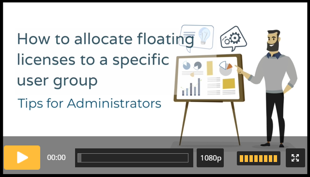

# Efecte Admin Tips - How to allocate floating licenses to a specific user group (video)

**Källa:** https://community.efecte.com/t/y4hpqza/efecte-admin-tips-how-to-allocate-floating-licenses-to-a-specific-user-group-video
**Publicerad:** 2021-08-30T07:14:17.570Z
**Uppdaterad:** 2025-12-10T11:34:15.833000
**Författare:** 

---

Efecte Admin Tips - How to allocate floating licenses to a specific user group (video)

      
    

        updated 1 mth agoWed, December 10, 2025 at 11:34 AM GMT+1
  
          

        
    
Sometimes you might need to store licenses to the separate subfolders.  There might be a need for allocating the floating licenses to the certain teams or user groups only and define the number of licenses that they are going to use. This ensures that there are enough licenses available for the intended users. For that, we need subfolders.  
Watch this video and learn how you can allocate floating licenses to a specific user group.
 Length: 06:33 Thanks for watching, and as always, don't hesitate to contact us in case you have any questions!
- Team Efecte
Haven't attended admin training yet or looking for a refresh? View upcoming dates and enroll to one of our public trainings here or send us email.
..Psst, don’t forget, we also offer tailored trainings, contact your account manager for more information.
          
    
        Service Management Tool
      
    
        Administration
      
    
  
  Like
  Follow
    
            4

## Bilder

