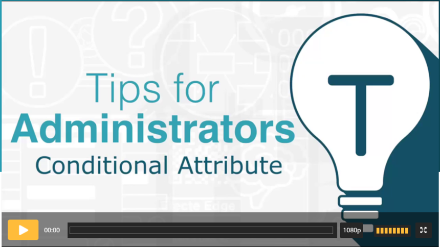

# Efecte Admin Tips - How to create conditionally visible attributes (video)

**Källa:** https://community.efecte.com/t/h7hf6h8/efecte-admin-tips-how-to-create-conditionally-visible-attributes-video
**Publicerad:** 2021-04-26T06:16:55.640Z
**Uppdaterad:** 2021-05-24T12:44:51.337000
**Författare:** 

---

Efecte Admin Tips - How to create conditionally visible attributes (video)

      
    

        updated 4 yrs agoMon, May 24, 2021 at 12:44 PM GMT+2
  
          2replies
        Minna KääriäinenEfecte Trainer4 yrs agoMon, September 20, 2021 at 8:13 AM GMT+2
  
        

        
    
 With conditional attributes you can create dynamic template content.   
 When template has an attribute with static values can other attributes be set to become visible based on the value in this attribute.    
 The use case in this video is Major Incident related conditional attributes in Incident template.  Those attributes will become visible based on the decision of the end-user on the Major incident attribute (Yes or No).   
 Watch this video and learn how to do it.    
    
 Thanks for watching, and as always, don't hesitate to contact us in case you have any questions!  
 - Team Efecte  
 Don’t have admin training or looking for a refresh? View upcoming dates and enroll to one of our public trainings here.  
 ..Psst, don’t forget, we also offer tailored trainings, contact your account manager for more information. 
          
    
        Administration
      
    
        Service Management Tool
      
    
        Video
      
    
  
  Like
  Follow
    
            4

## Bilder

