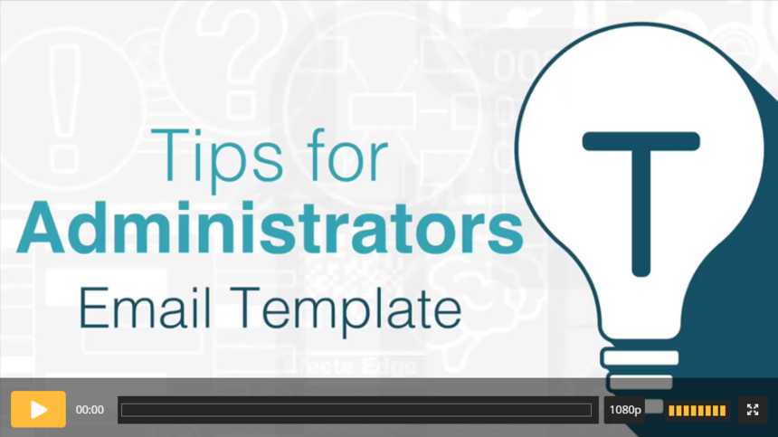

# Efecte Admin Tips - How to create new e-mail templates (video)

**Källa:** https://community.efecte.com/t/p8hl48p/efecte-admin-tips-how-to-create-new-e-mail-templates-video
**Publicerad:** 2021-04-12T06:19:32.800Z
**Uppdaterad:** 2021-05-24T12:46:04.100000
**Författare:** 

---

Efecte Admin Tips - How to create new e-mail templates (video)

      
    

        updated 4 yrs agoMon, May 24, 2021 at 12:46 PM GMT+2
  
          5replies
        Tiina Kaitosalmi2 yrs agoFri, March 3, 2023 at 1:27 PM GMT+1
  
        

        
    
 This video shows how you can edit or create new e-mail templates (EntityStateMail -handler), which are used when manually sending e-mails from different data cards (Incident, Service Request, Problem…).  
 Check the video and learn how to do it.  
   
 Thanks for watching, and as always, don't hesitate to contact us in case you have any questions!  
 - Team Efecte  
 Don’t have admin training or looking for a refresh? View upcoming dates and enroll to one of our public trainings here.  
 ..Psst, don’t forget, we also offer tailored trainings, contact your account manager for more information. 
          
    
        Service Management Tool
      
    
        Administration
      
    
        Video
      
    
  
  Like
  Follow
    
            7

## Bilder

