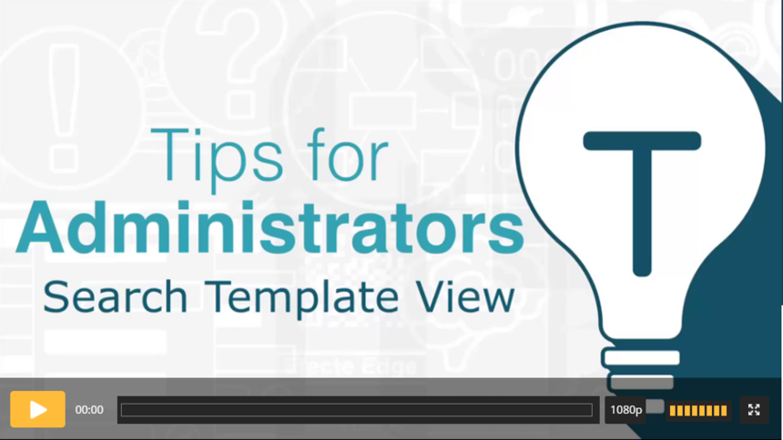

# Efecte Admin Tips - How to create search template view (video)

**Källa:** https://community.efecte.com/t/y4hlb66/efecte-admin-tips-how-to-create-search-template-view-video
**Publicerad:** 2021-03-29T06:23:20.987Z
**Uppdaterad:** 2025-12-10T11:37:10.790000
**Författare:** 

---

Efecte Admin Tips - How to create search template view (video)

      
    

        updated 1 mth agoWed, December 10, 2025 at 11:37 AM GMT+1
  
          2replies
        Tiina Kaitosalmi4 yrs agoMon, March 29, 2021 at 11:49 AM GMT+2
  
        

        
    
Search templates are very useful if you have a massive amount of data cards and you know what you are looking for. There is less activity to the server and therefore it makes finding data cards faster when you don’t have to wait for the initial list to appear.
This functionality is not only for the administrators. Normal level users can also create search template view. Normal level user can save the view only under personal view unless otherwise permitted. 
Check this video and learn how to create search template view.
  Thanks for watching, and as always, don't hesitate to contact us in case you have any questions!
- Team Efecte
Don’t have admin training or looking for a refresh? View upcoming dates and enroll to one of our public trainings here or send us email.
..Psst, don’t forget, we also offer tailored trainings, contact your account manager for more information.
          
    
        Service Management Tool
      
    
        Administration
      
    
        Video
      
    
  
  Like
  Follow
    
            3

## Bilder

