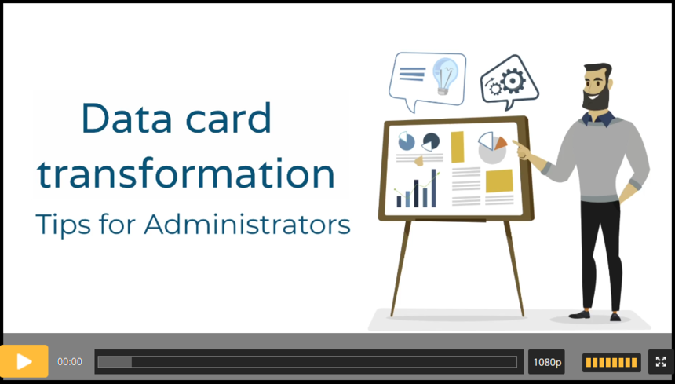

# Efecte Admin Tips - How to define data card transformation (video)

**Källa:** https://community.efecte.com/t/y4hf7ld/efecte-admin-tips-how-to-define-data-card-transformation-video
**Publicerad:** 2021-05-24T07:45:57.763Z
**Uppdaterad:** 2025-12-10T11:36:28.910000
**Författare:** 

---

Efecte Admin Tips - How to define data card transformation (video)

      
    

        updated 1 mth agoWed, December 10, 2025 at 11:36 AM GMT+1
  
          

        
    
With data card transformation you can easily transfer one data card to another.  
Transformation means that data card can be copied or rather its values can be copied into other types of data cards. For example an incident to a change or a knowledge base article. 
Watch this video and learn how to define it. 
  Thanks for watching, and as always, don't hesitate to contact us in case you have any questions!
- Team Efecte
Don’t have admin training or looking for a refresh? View upcoming dates and enroll to one of our public trainings here or send us email.
..Psst, don’t forget, we also offer tailored trainings, contact your account manager for more information.
          
    
        Administration
      
    
        Service Management Tool
      
    
        Video
      
    
  
  Like
  Follow

## Bilder

