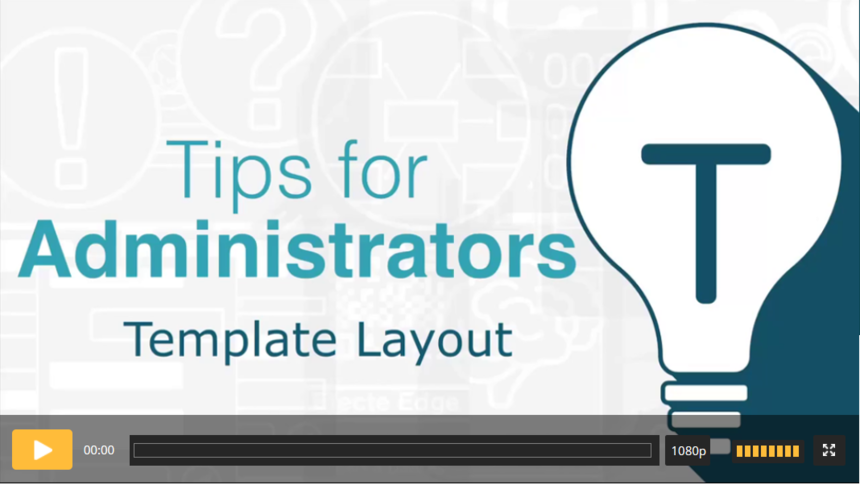

# Efecte Admin Tips - How to edit template layout (video)

**Källa:** https://community.efecte.com/t/m1hzbv4/efecte-admin-tips-how-to-edit-template-layout-video
**Publicerad:** 2021-02-15T07:20:00.000Z
**Uppdaterad:** 2025-12-10T11:39:30.727000
**Författare:** 

---

Efecte Admin Tips - How to edit template layout (video)

      
    

        updated 1 mth agoWed, December 10, 2025 at 11:39 AM GMT+1
  
          2replies
        Tiina Kaitosalmi4 yrs agoTue, February 16, 2021 at 2:16 PM GMT+1
  
        

        
    
This video will show you how easy it is to change the data card template layout. Just by dragging and dropping classes into one, two or three columns you can make the most of the layout.
By using containers, you can even have a mix of different numbers of columns. And now you can also change one column to be wider than the other. Check the video to learn how.
 Thanks for watching, and as always, don't hesitate to contact us in case you have any questions!
- Team Efecte
Don’t have admin training or looking for a refresh? View upcoming dates and enroll to one of our public trainings here or send us email.
..Psst, don’t forget, we also offer tailored trainings, contact your account manager for more information.
          
    
        Administration
      
    
        Service Management Tool
      
    
        Templates
      
    
        Video
      
    
  
  Like
  Follow
    
            3

## Bilder

