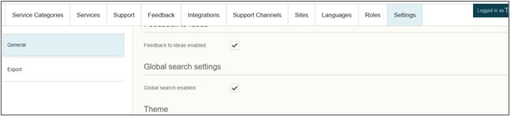
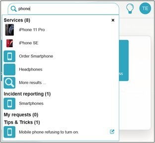

# Efecte Admin Tips - How to enable global search in Self-Service Portal

**Källa:** https://community.efecte.com/t/h7hlqqm/efecte-admin-tips-how-to-enable-global-search-in-self-service-portal
**Publicerad:** 2021-03-01T08:16:00.000Z
**Uppdaterad:** 2025-12-10T11:38:49.213000
**Författare:** 

---

Efecte Admin Tips - How to enable global search in Self-Service Portal

      
    

        updated 1 mth agoWed, December 10, 2025 at 11:38 AM GMT+1
  
          

        
    
Global Search in Efecte Self-Service Portal (ESS) is a quick way to find services, own requests from the My requests view, knowledge base articles and more. All you need to do is to enable the search from admin settings. Go to the ESS admin UI and select Global search enabled.   Global search finds
·        available services by their name and their service item name ·        available incident reporting domain names and their categories ·        previous own incident reports by their subject and ID ·        previous own requests for service by their name and ID ·        Tips and Tricks by their keywords
Please notice that Global search doesn't find any requests made by others in the Our requests view, only user's own.

Thanks for reading, and as always, don't hesitate to contact us in case you have any questions!
- Team Efecte
Don’t have admin training or looking for a refresh? View upcoming dates and enroll to one of our public trainings here or send us email.
..Psst, don’t forget, we also offer tailored trainings, contact your account manager for more information.
          
    
        Self-Service Portal
      
    
        Administration
      
    
  
  Like
  Follow
    
            2

## Bilder

