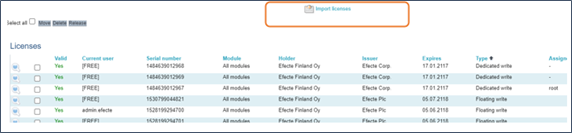
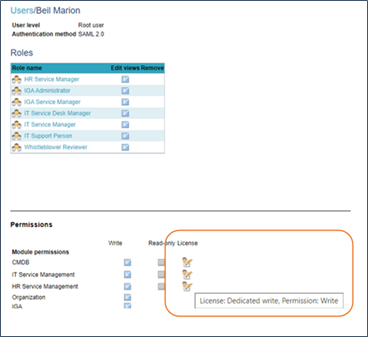
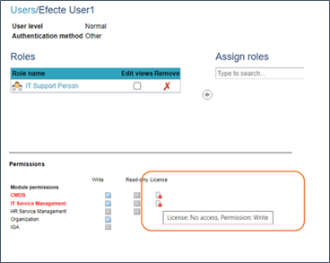

# Efecte Admin Tips - How to import and assign user licenses

**Källa:** https://community.efecte.com/t/q6h1rbt/efecte-admin-tips-how-to-import-and-assign-user-licenses
**Publicerad:** 2021-08-16T06:33:00.000Z
**Uppdaterad:** 2025-12-10T11:34:51.367000
**Författare:** 

---

Efecte Admin Tips - How to import and assign user licenses

      
    

        updated 1 mth agoWed, December 10, 2025 at 11:34 AM GMT+1
  
          

        
    
How to import user licenses
When you need to import new licenses, that happens in the Licenses tab. Maybe you have new users and you have purchased new licenses to them. Start the process for requesting new licenses from your Efecte Account Manager. Once the licenses are ready, Efecte Service Desk will provide you a zip file. Unzip the file so that you can import the license.xml file. With new licenses you may skip the next chapter.
If you are replacing expired/expiring fixed term licenses with new ones: If licenses have expired, please delete all expired licenses before importing new ones. If the soon expiring licenses are being used, you can still replace them with new ones before they expire like this: 1. Sort all current licenses with Serial number or Expiry date. 2. Take a screenshot from the Licenses tab so that you know who had which license and in which folders they were stored. 3. Select and release all the soon expiring licenses. You can release a license even though it is currently in use ("Current User" not [FREE]). Releasing a license won't disconnect the user's ESM session because the license is actually released when the user logs out (or session is terminated after idle hours). 4.  Create a subfolder called "zOld" (in Permissions tab) and move the released soon expiring dedicated licenses which are currently still in use there. Don't move any user cards into that subfolder. You can delete the expiring licenses from there the next day when they are no longer in use. 5. Import the new licenses (and move them into subfolders if the expiring licenses were in subfolders). You can also assign the new licenses to the users at the same time (according to the information in the screenshot that you took in step 1, or let the licenses auto-allocate to users who log in without a license. Importing new ESM user licenses:
1. Click the Import license button on the top.

2. Click Choose file and browse for the license file, then click Ok. Licenses are always imported to the Licenses root folder. Licenses can be moved into their folders after they have been imported if needed.
3. If the licenses and their users are located in subfolders (e.g. based on cost centers or license types) you should assign the Dedicated licenses to the users manually in the Licenses tab. Just click on the magnifying glass icon in front of the license and then select the user. If you need to assign new licenses to users and release expiring licenses, you can do that although the users are logged in. It doesn't terminate their ESM sessions because the licenses you release are actually released after the users log out.
4. If the licenses are stored in the Licenses tree root level then you may let the new licenses to be automatically assigned to users in random order (not available in on-premises environments). In Efecte Cloud environments the All modules Dedicated write licenses are automatically assigned to users on their next login IF the users don't have a Dedicated All modules license assigned to them yet (valid/expired one). You need to release the expiring/expired licenses from users in order for the license auto-allocation to work
Auto-allocation in cloud environments
When user, who has no license logs in, the license auto-allocation order is following:
1. free Floating All modules licenses from the subfolder where the User data card is saved in.
2. free Floating All modules licenses from the Licenses Root folder
3. free Dedicated All modules licenses in the subfolder where the User data card is saved in.
4. free Dedicated All modules licenses from the Licenses Root folder
Note! free Dedicated Module specific licenses aren't auto-assigned to new users in login. Those can be easily assigned to the users by Efecte administrator in the Permissions tree (Select user -> Click on "Assign licenses").
If your environment has both All modules and Module specific licenses, like IT Processes or CMDB, you need to store the Module specific licenses and their users in one subfolder, and the All modules licenses and their users in another subfolder. No free licenses should be stored on the License tree root level in this case.  
Additional info: How does license info look like in the Permissions tab?
1. User who is using a dedicated license

2. User who is using a floating license
Although license info in the Permissions tab informs “License: No access.“, license is ok. Only assignment of dedicated license will remove that info and red colour. User can continue using Efecte with floating license.

Thanks for reading, and as always, don't hesitate to contact us in case you have any questions!
- Team Efecte
Haven't attended admin training yet or looking for a refresh? View upcoming dates and enroll to one of our public trainings here or send us email.
..Psst, don’t forget, we also offer tailored trainings, contact your account manager for more information.
          
    
        Service Management Tool
      
    
        Administration
      
    
  
  Like
  Follow
    
            2

## Bilder

