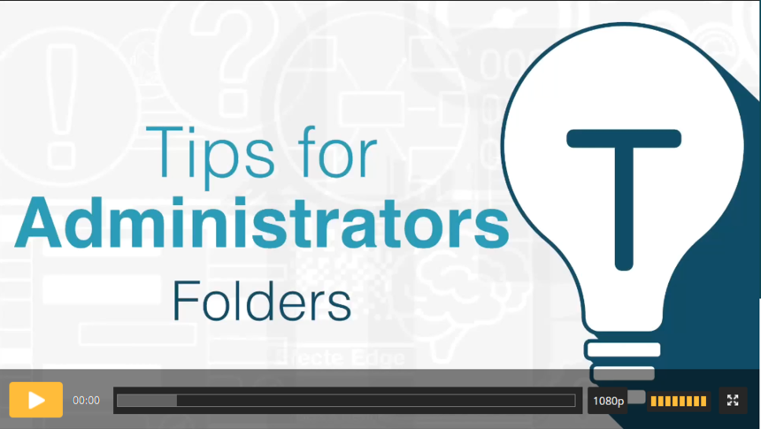

# Efecte Admin Tips - How to manage folders (video)

**Källa:** https://community.efecte.com/t/83hll5y/efecte-admin-tips-how-to-manage-folders-video
**Publicerad:** 2021-03-15T08:22:33.250Z
**Uppdaterad:** 2025-12-10T11:38:09.870000
**Författare:** 

---

Efecte Admin Tips - How to manage folders (video)

      
    

        updated 1 mth agoWed, December 10, 2025 at 11:38 AM GMT+1
  
          

        
    
Folders are used as a storage for data cards. Folders also define permissions based on roles to limit who can access which data within the system.  
This video will tell you the most important information how you can manage folders.
 Thanks for watching, and as always, don't hesitate to contact us in case you have any questions!
- Team Efecte
Don’t have admin training or looking for a refresh? View upcoming dates and enroll to one of our public trainings here or send us email.
..Psst, don’t forget, we also offer tailored trainings, contact your account manager for more information.
          
    
        Service Management Tool
      
    
        Administration
      
    
        Video
      
    
  
  Like
  Follow
    
            4

## Bilder

