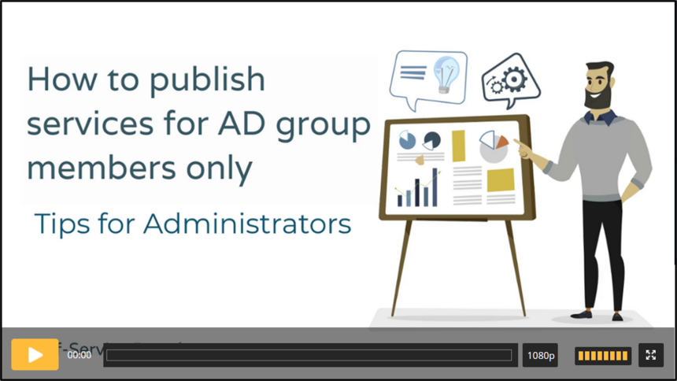

# Efecte Admin Tips - How to publish services in Self-Service for AD group members only (video)

**Källa:** https://community.efecte.com/t/x2hp7zh/efecte-admin-tips-how-to-publish-services-in-self-service-for-ad-group-members-only-video
**Publicerad:** 2021-09-27T06:17:09.907Z
**Uppdaterad:** 2025-12-10T11:18:04.113000
**Författare:** 

---

Efecte Admin Tips - How to publish services in Self-Service for AD group members only (video)

      
    

        updated 1 mth agoWed, December 10, 2025 at 11:18 AM GMT+1
  
          

        
    
With the role specific service you can limit your service visibility in Self-Service Portal to a certain group only. Roles in Self-Service Portal utilizes AD groups. For example if you offer a certain service or services only to managers, you could publish those only to that role. 
Watch this video and learn how you can do it. 
 Length: 02:39
Thanks for watching, and as always, don't hesitate to contact us in case you have any questions!
- Team Efecte
Haven't attended admin training yet or looking for a refresh? View upcoming dates and enroll to one of our public trainings here or send us email.
..Psst, don’t forget, we also offer tailored trainings, contact your account manager for more information.
          
    
        Self-Service Portal
      
    
        Administration
      
    
        Video
      
    
  
  Like
  Follow

## Bilder

