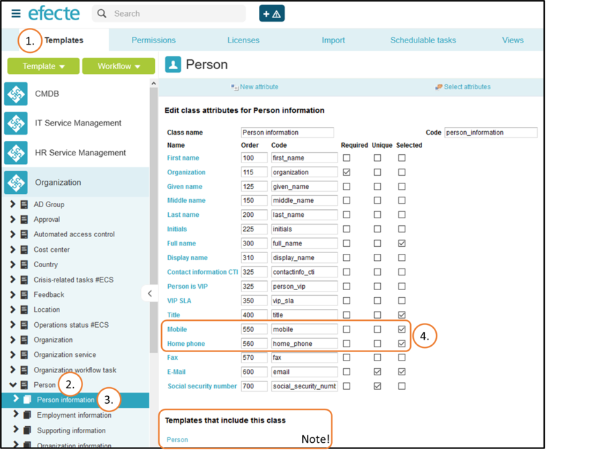
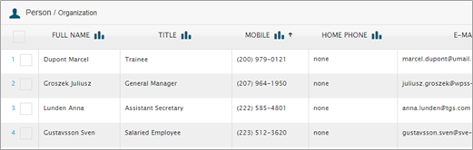
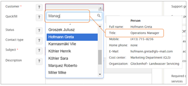

# Efecte Admin Tips - How to select which fields are shown in pop-up windows, and as default columns (Selected attributes)

**Källa:** https://community.efecte.com/t/p8hkzf5/efecte-admin-tips-how-to-select-which-fields-are-shown-in-pop-up-windows-and-as-default-columns-selected-attributes
**Publicerad:** 2021-06-21T07:17:52.423Z
**Uppdaterad:** 2025-12-10T11:35:30.420000
**Författare:** 

---

Efecte Admin Tips - How to select which fields are shown in pop-up windows, and as default columns (Selected attributes)

      
    

        updated 1 mth agoWed, December 10, 2025 at 11:35 AM GMT+1
  
          

        
    
Pop-up windows
If you are hovering your mouse on top of a link of a data card, a pop-up window will be displayed with fields (attributes) which are selected by an administrator in the template. Those fields which do not have value, will not be shown. For example, if Cost center in a Person data card would be empty, that field would not be shown at all in the screen shot below.

How to define selected fields
If you want to display new field/s in the pop-up window, you need to define those attributes as Selected in the template. Let´s say that you want to show phone numbers so that users will see the phone numbers immediately without extra clicking.
1.      Go to the Administration Templates tab.
2.      Choose the correct template. In this case Person template under Organization module.
3.      Choose the class where you have the attribute you want to be displayed. In this case it is Person information class where all the phone numbers are.
4.      Check the attributes as Selected. In this case both phone number fields are checked.
 5.      Remember to save your changes.
6.      Now both Mobile and Home phone fields will be shown in the pop-up window if they have values.
Note! If this class is used in other Templates, this change would affect those templates as well.
There are also other things, where checking this selected has effect on.
Default columns
When we start to create a new view from New view menu, the columns that we get as default are also the Selected ones.

Reference search
You can also use those Selected values whenever you are searching for the reference. For example, if you search for a Person, the results include Persons with that name but also Persons with that email address, title, cost center, whatever is defined as selected attributes of this referenced template.  

Thanks for reading, and as always, don't hesitate to contact us in case you have any questions!
- Team Efecte
Haven't attended admin training yet or looking for a refresh? View upcoming dates and enroll to one of our public trainings here or send us email.
..Psst, don’t forget, we also offer tailored trainings, contact your account manager for more information.
          
    
        Service Management Tool
      
    
        Administration
      
    
  
  Like
  Follow

## Bilder

