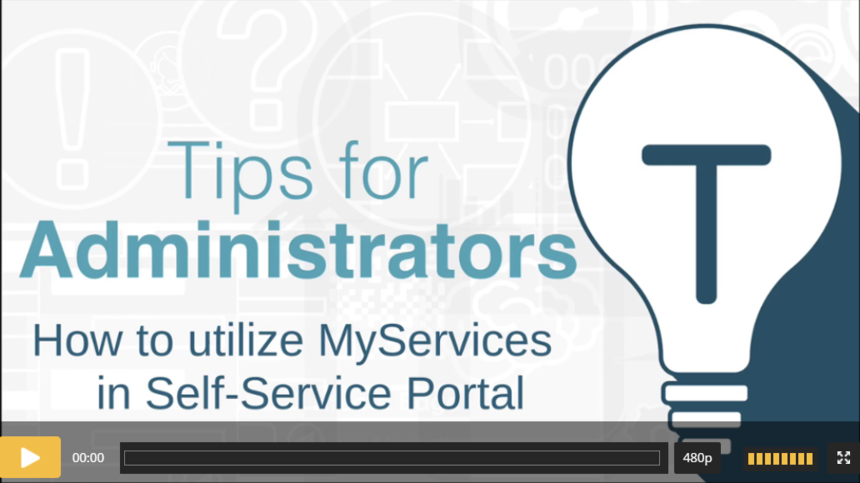

# Efecte Admin Tips - How to utilize MyServices in Self-Service Portal (video)

**Källa:** https://community.efecte.com/t/35hkqvv/efecte-admin-tips-how-to-utilize-myservices-in-self-service-portal-video
**Publicerad:** 2021-06-07T07:50:21.857Z
**Uppdaterad:** 2025-12-10T11:35:59.820000
**Författare:** 

---

Efecte Admin Tips - How to utilize MyServices in Self-Service Portal (video)

      
    

        updated 1 mth agoWed, December 10, 2025 at 11:35 AM GMT+1
  
          

        
    
This video contains information on how to define MyServices to be used with service offers and incident reporting forms. MyServices can be used in My things as well.  
What are MyServices?   Efecte Self-Service Portal supports displaying user or service specific information saved in Service Management. So, we can use the data which already exists in Service Management as dropdown values and MyThings lists. This information might entail for example which assets have been registered for a particular user, list of cost centers, locations and so on. The information is used as part of service request as well as in incident reports to make service flow smoother.
Watch this video and learn how to define and utilize MyServices.
 Length: 09:23
Thanks for watching, and as always, don't hesitate to contact us in case you have any questions!
- Team Efecte
Haven't attended admin training yet or looking for a refresh? View upcoming dates and enroll to one of our public trainings here or send us email.
..Psst, don’t forget, we also offer tailored trainings, contact your account manager for more information.
          
    
        Administration
      
    
        Self-Service Portal
      
    
        Video
      
    
  
  Like
  Follow
    
            2

## Bilder

