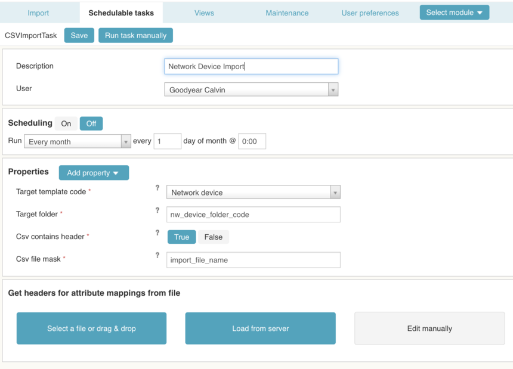

# Efecte Admin Tips - Importing & Exporting Data

**Källa:** https://community.efecte.com/t/y4h6d2l/efecte-admin-tips-importing-exporting-data
**Publicerad:** 2020-10-13T07:34:27.427Z
**Uppdaterad:** 2025-12-10T11:43:43.747000
**Författare:** 

---

Efecte Admin Tips - Importing & Exporting Data

      
    

        updated 1 mth agoWed, December 10, 2025 at 11:43 AM GMT+1
  
          4replies
        Aki Koivukoski5 yrs agoWed, October 14, 2020 at 1:32 PM GMT+2
  
        

        
    
Have you ever faced the need to import data into Efecte from an existing source? Or maybe you wish to export Efecte data to be used elsewhere? Either or, this posting is for you.
Both import and export can be divided into two: a one-time job or a recurring event, but for some needs, there’s also real-time integrations. Let’s take a look.
 
Imports & Updates
For occasional data imports (and updates) there is a handy tool that makes data updates easy. With the tool you can use Excel for the imports and mass-editing – this tool is conventionally named “Efecte tools for Excel”, you can find it here: https://efecteexceltools.com/ . But remember - for a truly one-time import, just hand over your data to one of our consultants and they’ll transform and import it to Efecte in no time.
For recurring imports, ESM has a built-in tool for CSV-imports. On the other end, the data can be exported into CSV and outputted to an (S)FTP location where it can then be imported automatically to Efecte. In order to do this, head to Schedulable tasks (under administration), click “Add new task” from the left-hand menu and select the CSVImportTask. Now all you need to do is give the task it’s parameters and it’s good to go!
 

Exports
A one-time data export from Efecte couldn’t be easier. If you are exporting graphics, simply select the chart to be exported, click the Export button right above it and choose the format for exporting it in either PNG or PDF. The same goes for lists, simply select the list view you wish to export and click the Export-button right above it to export the list into Excel.
For a recurring export, you can head to Schedulable Tasks (under administration) and add a new “ReportExportTask”. With ReportExportTask you can output some of the pre-configured views into a file in a recurring fashion. The utility stores the file on to Efecte server’s disk, so some additional steps might be needed to carry the file out of the cloud environment, please contact us in such case.
 
Remarks
Now, there are some things to consider when exporting data. First, be conscious with naming, especially with charts, as it might not be self-explanatory which conditions apply to the chart formed (conditions like time-period and filters for category, support group, service etc.).
The second thing to bear in mind is that exporting a list will export all results on the list (regardless of pagination), but only the selected attributes. So, you may get more results than your current view shows (default page size is 50 results), but you might miss some data if a column you’d wish to see on the export is not visible. Obviously, conditions applied to the view also affect the exported data.
Thirdly, maybe needless to say, but for the sake of clarity: besides conditions, remember that user access rights can limit the results as well as the basic settings whether the view includes only visible data cards, hidden ones or both. This is crucial when your report has both active and end-of-life-cycle data cards. For example, when plotting a chart of “Incidents with rolling 12 months creation date” it will contain both the Incidents still to be resolved and the closed ones too (which Efecte automatically hides).
 
Need for more?
When you need real-time integrations for status updates, value mappings, data-format changes and monitoring, we suggest switching to integrations. With our API, all data can be exported and imported to sync with external applications and vendors. To make the integrations a breeze, we have a turn-key solution for it called Efecte Integration Service (or EIS). With EIS, integrations are built with a modern visual integration platform and the know-how for integrating Efecte is at your service for fast deployments and for reliably integrating data to and from Efecte.
To learn more about EIS and see some of the examples to which apps we have created integrations to, visit our website at: https://www.efecte.com/efecte-integration-services.
 
- Team Efecte
 
Don’t have admin training or looking for a refresh? View upcoming dates and enroll to one of our public trainings here or send us email.
..Psst, don’t forget, we also offer tailored trainings, contact your account manager for more information.
          
    
        Administration
      
    
  
  Like
  Follow
    
            2

## Bilder

