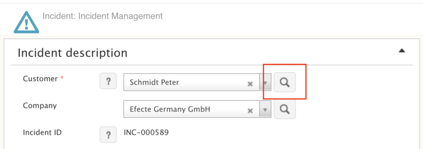
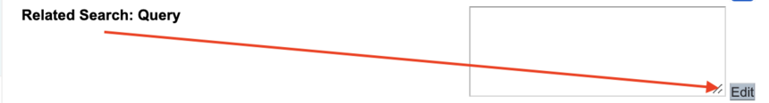
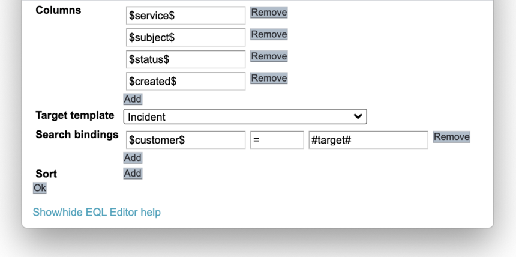

# Efecte Admin Tips - Related Search Query

**Källa:** https://community.efecte.com/t/y4hmyk5/efecte-admin-tips-related-search-query
**Publicerad:** 2020-10-29T11:05:57.400Z
**Uppdaterad:** 2025-12-10T11:42:34.763000
**Författare:** 

---

Efecte Admin Tips - Related Search Query

      
    

        updated 1 mth agoWed, December 10, 2025 at 11:42 AM GMT+1
  
          2replies
        Aki Koivukoski5 yrs agoFri, October 30, 2020 at 2:01 PM GMT+1
  
        

        
    
With a click of a button, quickly find if an Incident already exists with Related Search Query.
A customer talks to you about an Incident and you wonder: “I think I’ve heard this one before”. Now, you could do a search of open issues with the customer’s name, but there’s an even simpler way to do it in the new data card view. To see if the customer has already reported the same issue earlier, we can configure a one-click search button (with a magnifier icon on it) and it’s called the Related Search Query.

In order to enable the feature, head to Admin tools, browse to the Incident -template and go to the “Customer” -attribute’s metadata. Advanced users could input in the EQL for the Related Search directly, but don’t worry, we’ll use the EQL editor for this example.
You should now see an input field labelled as “Related search: Query” (not to be confused with Search filter), hit “Edit” next to it and an EQL editor pop-up appears.  

Here we can click “Add” next to “Columns” to configure which attributes of the target template are shown when the Related Search Query is triggered. As in the example below, the inputs are given as a reference (dollar signs at both ends) to the target template’s attribute codes. In case you don’t have the codes available, open admin tools on another browser tab to look for the codes more easily.
Below columns, select the target template and set the conditions how to search for the related data cards. In this example we’ll use the Related Search specific #target# macro (a data card macro that refers to the selected value) to look for Incidents with same Customer.

Notice that there’s also a “Show/hide EQL Editor help” -link at the bottom of the pop-up for more details.
Now that we’re done, click “OK”. This will close the pop-up and take you back to attribute metadata. You see that the “Related Search: Query” now has the ready EQL (or Efecte Query Language) which you can modify further or use the Edit button to go back to editor to change the parameters.  
Pro tip 1: You can also configure multiple Related Search Queries to the same attribute, for example to search for users Workstation on the same go.
Pro tip 2: You can configure the Related Search Query to any reference attribute (not just the “customer” attribute on the Incident template) to look for data cards that have the same input.
 
There we go, one-click search for related data cards!
 
- Team Efecte
 
P.s. Remember that this is only an example and as such it might not work in your environment as the attribute codes in your environment might differ from the ones shown in the example. In case you are unable to make it work, first thing to do is check the codes and double check the spelling. If still no luck, let our consultants fix it for you :)
 
Don’t have admin training or looking for a refresh? View upcoming dates and enroll to one of our public trainings here or send us email.
..Psst, don’t forget, we also offer tailored trainings, contact your account manager for more information.
          
    
        Administration
      
    
  
  Like
  Follow
    
            4

## Bilder

