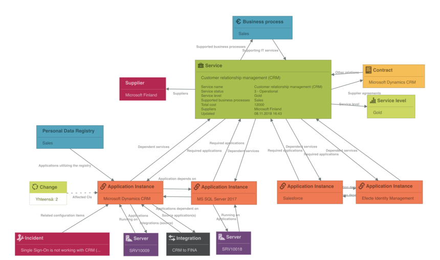

# Efecte Admin Tips - Taking Visual Analyzer into Good Use

**Källa:** https://community.efecte.com/t/x2h63bk/efecte-admin-tips-taking-visual-analyzer-into-good-use
**Publicerad:** 2020-09-15T08:39:29.143Z
**Uppdaterad:** 2025-12-10T11:46:42.587000
**Författare:** 

---

Efecte Admin Tips - Taking Visual Analyzer into Good Use

      
    

        updated 1 mth agoWed, December 10, 2025 at 11:46 AM GMT+1
  
          

        
    
Efecte’s Visual Analyzer has been around for a while. Since its initial launch, the handy visualization tool has made its way to customers’ hearts permanently. Later, the original code has been revised to part ways with client-side Java in favor for HTML5 which is fully supported by modern browsers without any add-ons. Powerful and included in all of our customer Efecte installations, Visual Analyzer is at your service, without additional costs of course.
The tool is designed to visualize basically everything what’s so great about Efecte. Complex relationships between CMDB items, business owners, suppliers and even processes and custom solutions. The information is already there and Efecte’s Visual Analyzer turns it into a more tangible asset, a visualized view of live data.

Here's a couple of typical use cases for the Visual Analyzer:

 CMDB modelling - how things are related, which Service depends on which Asset or software etc.
 Network topology - visualize how different networks are interconnected through routers.
 Process visualization - which business applications have planned Changes? Or say you have figured out the root cause of a Problem (linked to various CI's) and need some Changes. Do a quick impact analysis beforehand with Visual Analyzer.
 Contract relationships - multi-dimensional, complex contracts? Visualize which contracts are linked to a frame agreement and which contract replaces the other and so on.

... and much more. Basically all data and relations in Efecte can be shown in Visual Analyzer.
 
And it’s not like you’d need to be an IT Architect (or a lawyer) to benefit from Visual Analyzer. If you’re, say a Server Admin wondering what would happen after rebooting a Server, turn to Visual Analyzer and know who and which Services are impacted.
Running Visual Analyzer couldn’t be any easier. To drill in deeper to the data, simply double tap on any Visual Analyzer node to expand and show next relationships. To make the view more readable, uncheck the “Show” next to templates not needed in Visualization or have similar items Grouped (by checking the corresponding checkbox). You can also re-arrange the nodes into more logical order, as the picture is drawn dynamically each time from up-to-date live data. Need to save the snapshot for later? A screenshot is your friend there ;)
 
So, where to start? The correct answer is with any data card, but you could try it out using the Service template as we have in the example. Simply open any data card and under the “More” -menu (top right corner) click the Visual Analyzer open. And Admins, no need to worry, it’ll always show data per user’s access rights. 
 
Happy days! Now go and take Visual Analyzer to good use!
 
- Team Efecte
 
p.s. Not every data card is linked to another. This is due to data and configuration. For configuration, there’s an easy fix: simply add a new Reference field on to the template (or Back reference when appropriate). For data, the information needs to first be filled in either by integration or a person.
 
Don't have admin training or looking for a refresh? View upcoming dates and enroll to one of our public trainings here or send us email.
..Psst, don't forget, we also offer tailored trainings, contact your account manager for more information.
          
    
        Administration
      
    
  
  Like
  Follow
    
            2

## Bilder

